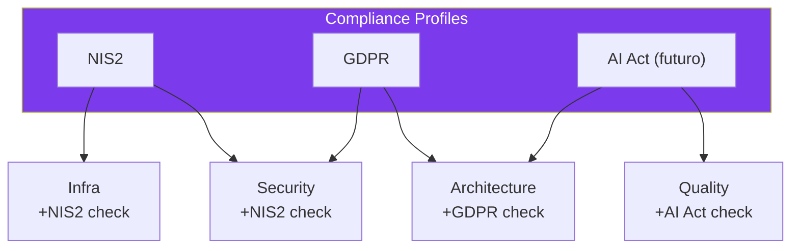
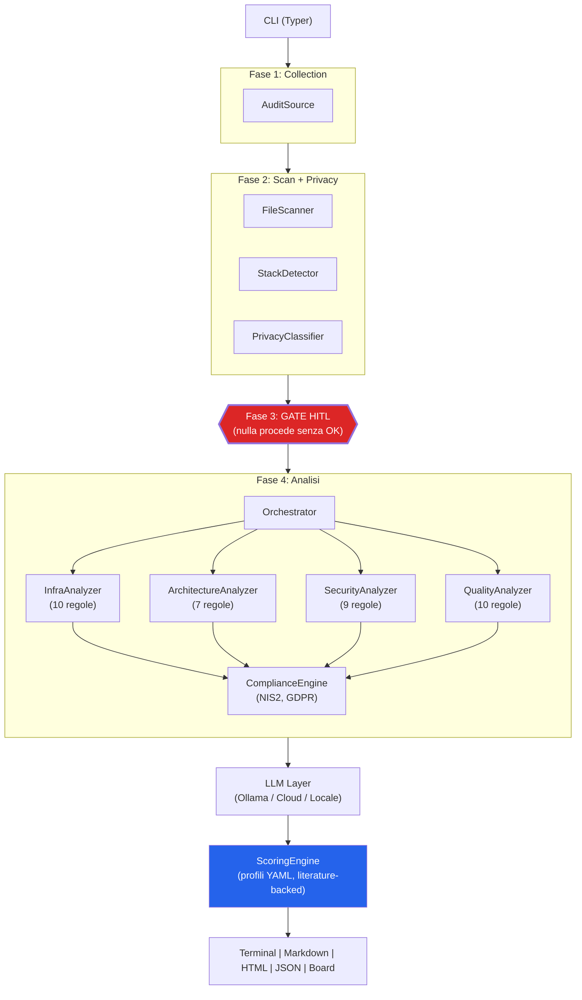

# CTO Audit Agent — Concept Document
# v8.0 — Defensible Scoring + Full Benchmark Validation

> **Stato progetto (v0.4.0)**: Fase 1 completa + Fase NEXT completa + Fase 2 parziale.
> **733 test** (31 test file), 7 scenari realistici + board report. Validato su **29 repo**
> (20 reali + 9 sintetiche). Benchmark reale: media 78.3/100 su 10 linguaggi.
> Benchmark sintetico: 100% recall, 100% precision su 9 scenari.
> **Tutti e 4 gli analyzer IMPLEMENTATI**: Infra (10 regole), Architecture (7 regole),
> Security (9 check), Quality (10 check). Totale: 36 regole di analisi.
> **Compliance engine IMPLEMENTATO**: profili NIS2 e GDPR operativi, modalita' hybrid di default.
> **HTML reporter IMPLEMENTATO**: report standalone con scoring tracciabile.
> **Remediation Pipeline operativa**: Knowledge Base YAML (37 entry), What-If Simulator,
> Context Collector, Board Report deterministico, LLM Provider (Ollama), Interpretation
> Agent con HITL gate. CLI: `--board-report --no-llm --detailed`.
> **Scoring difendibile**: pesi basati su IBM/Ponemon 2025, DORA 2024, Boehm 1981, OWASP.
> Ogni peso ha citation. 2 profili di scoring: `default` + `vc-diligence`.
> **Context-aware Docker check**: penalita' Dockerfile calibrate in base al contesto progetto
> (`_is_deployable()` con INFRA-DOCKER-INFO per progetti non-web).
> **Graceful degradation**: funziona 100% senza LLM con template dalla KB.

## L'Idea in Una Frase

**Un sistema di agenti AI che analizza un software come farebbe un CTO esperto al suo primo giorno in azienda: parte dall'infrastruttura, risale all'architettura, poi sicurezza, poi codice — e produce un report esecutivo con scoring tracciabile, verifica di compliance normativa, e piano d'azione prioritizzato. Il tutto con la garanzia che nessun dato sensibile lasci la macchina del cliente senza consenso esplicito.**

---

## Il Problema che Risolve

Quando un fractional CTO/Head of Engineering entra in un'azienda:

- **Settimana 1-2**: Legge codice, chiede in giro, naviga repo, guarda pipeline
- **Settimana 3**: Si fa un'opinione generale
- **Settimana 4**: Produce un assessment iniziale

Con questo tool:

- **Ora 1**: Lancia il tool sul codebase del cliente
- **Ora 2**: Rivede la classificazione privacy, conferma cosa può uscire e cosa no
- **Ora 3**: Ha un report strutturato con findings, scoring tracciabile, gap di compliance, e piano d'azione

**Da 4 settimane a 3 ore.** Non sostituisce l'esperienza umana, la accelera.

---

## Due Modalità d'Uso

| Scenario | Chi lo usa | Come funziona | Vincoli |
|----------|-----------|---------------|---------|
| **Consulente** | Il fractional CTO entra in azienda e lancia il tool sui sistemi del cliente | Il tool gira sulla macchina del cliente. Il codice non viene mai clonato né copiato. Il report esce, il codice resta. | **Zero data exfiltration.** La classificazione privacy + review umano garantisce che nulla di sensibile transiti verso servizi cloud senza consenso. |
| **Self-service** | Il cliente (o il suo team) lancia il tool su se stesso per fare autodiagnostica | Il cliente ha pieno controllo: può clonare, copiare, mandare tutto al cloud se vuole. | Nessun vincolo tecnico. Il tool informa comunque sui file sensibili trovati. |

Il tool supporta entrambi gli scenari nativamente. La differenza è nella configurazione, non nell'architettura.

---

## Principi Fondamentali

### 1. Infrastruttura Agnostica

Il tool **non assume nulla** sull'infrastruttura del cliente. Non cerca "AWS" o "Kubernetes" — cerca **qualsiasi cosa che descriva infrastruttura** e la valuta per quello che è.

Funziona identicamente se l'infra è:
- **Public cloud** (AWS, GCP, Azure)
- **On-premise** (server fisici, VMware, OpenStack)
- **Datacenter privato** (colocation, bare metal affittato)
- **Ibrida** (mix di cloud e on-prem)
- **Serverless** (Lambda, Cloud Functions, Vercel)
- **Nessuna** (deploy manuale via FTP → finding critico)

### 2. Language Agnostic

Il tool analizza **qualsiasi linguaggio e stack** del cliente. Non e' un linter Python — e' un auditor che rileva lo stack tecnologico e valuta infrastruttura e architettura indipendentemente dal linguaggio.

> **Stato attuale**: Lo stack detection supporta Python, JavaScript/TypeScript, Java, Go,
> Rust, Ruby, PHP, C#, C/C++, Kotlin, Swift, Scala, Elixir (rilevamento tramite file manifesto
> e pattern). L'estrazione degli import per l'analisi del coupling funziona per **Python e
> JS/TS**; per altri linguaggi (Java, Go, etc.) il coupling analysis non e' ancora attivo.
> tree-sitter e' nelle dipendenze ma non ancora utilizzato per il parsing AST.

### 3. Resilienza al Codice Frammentato

Nella realtà aziendale il codice non è mai tutto in un unico repo ordinato. Si trovano:
- 5 repo su GitHub, 2 su GitLab self-hosted, uno su Bitbucket
- Un monorepo con 3 servizi + 4 microservizi separati
- Script di deploy su un server che non sono in nessun repo
- Pezzi di infrastruttura definiti solo a voce o in un wiki

Il tool è progettato per gestire questa frammentazione:
- **MVP**: analisi di singolo repo/path locale
- **Architettura**: nativamente multi-source — ogni sorgente è un'interfaccia astratta, aggiungere nuove sorgenti (secondo repo, server remoto, etc.) è solo una nuova implementazione della stessa interfaccia
- Il report finale aggrega e correla i finding anche da sorgenti diverse

### 4. Privacy by Design — Human-in-the-Loop

**Nessun byte di codice lascia la macchina del cliente senza consenso esplicito.**

Il flusso prevede un gate obbligatorio tra la scansione e l'analisi:

```
SCAN → CLASSIFICAZIONE AUTO → ██ STOP: REVIEW UMANO ██ → ANALISI
```

L'umano vede esattamente quali file verrebbero inviati al cloud, quali restano locali, e può correggere qualsiasi classificazione prima di procedere. Dettagli completi nel documento dedicato (03-hitl-flow.md).

### 5. Scoring Tracciabile e Pluggable

Lo scoring **non è inventato**. È un engine configurabile che può basarsi su:
- Framework riconosciuti (NIST CSF, ISO 27001, OWASP ASVS, CVSS)
- Pesi custom definiti dal CTO
- Una combinazione dei due

Il punto chiave: **ogni score è tracciabile**. Per ogni punteggio il report mostra quale finding lo ha generato, quale regola ha matchato, e opzionalmente a quale controllo di un framework riconosciuto corrisponde.

Il sistema di scoring è un componente separato. Cambiare da "pesi custom" a "mapping NIST" significa cambiare un file di configurazione, non riscrivere codice. Dettagli nel documento 02-architecture.md.

### 6. Compliance Modulare

La compliance normativa (AI Act, NIS2, GDPR, SOC2, OWASP, PCI-DSS, etc.) è gestita come **set di profili attivabili**, non come logica hardcoded.

Ogni profilo di compliance è un modulo indipendente che:
- Può funzionare come **layer autonomo** (5° layer di analisi)
- Può **iniettare check nei 4 layer esistenti** (cross-cutting)
- Può fare **entrambe le cose** (check distribuiti + sezione dedicata nel report)

Il CTO sceglie quali profili attivare per ogni cliente. Un fintech attiva PCI-DSS. Un'azienda AI attiva AI Act. Una PMI europea attiva NIS2 + GDPR. Il tool si adatta.

Questa flessibilità è un requisito architetturale, non una feature futura: l'architettura è costruita per supportare qualsiasi modalità senza refactoring.

---

## Come Funziona (UX)

```bash
# Installazione
pip install cto-audit

# Uso base: audit completo
cto-audit scan /path/to/codebase

# Scan con focus specifico (salta layer non richiesti)
cto-audit scan /path/to/codebase --focus infra
cto-audit scan /path/to/codebase --focus architecture
cto-audit scan /path/to/codebase --focus security

# Attiva profili di compliance
cto-audit scan /path/to/codebase --compliance ai-act,nis2
cto-audit scan /path/to/codebase --compliance gdpr,pci-dss
cto-audit scan /path/to/codebase --compliance owasp-top10

# Scegli il profilo di scoring
cto-audit scan /path/to/codebase --scoring nist-csf
cto-audit scan /path/to/codebase --scoring owasp-asvs
cto-audit scan /path/to/codebase --scoring custom    # usa .cto-audit-scoring.yml

# Modalità 100% offline (nessun dato esce dalla macchina)
cto-audit scan /path/to/codebase --offline

# Riusa classificazione precedente (skip review)
cto-audit scan /path/to/codebase --reuse-classification

# Board report deterministico (senza LLM)
cto-audit scan /path/to/codebase --board-report --no-llm

# Report dettagliato con breakdown per check
cto-audit scan /path/to/codebase --detailed

# Output come report HTML standalone
cto-audit scan /path/to/codebase --output report.html

# Output JSON (machine-readable)
cto-audit scan /path/to/codebase --output report.json

# Output PDF
cto-audit scan /path/to/codebase --output report.pdf

# Combinazioni
cto-audit scan /path/to/codebase --board-report --no-llm --detailed --output report.html
```

### Output Esempio (terminale)

```
╔══════════════════════════════════════════════════════════╗
║              CTO AUDIT REPORT — Progetto X              ║
║              Stack: Python/FastAPI + React               ║
║              LOC: ~45,000 | Files: 312                   ║
║              Infra: Docker + GitHub Actions + AWS ECS    ║
║              Modalità: Ibrida (285 cloud / 25 locale)    ║
║              Scoring: NIST CSF | Compliance: NIS2, GDPR  ║
╠══════════════════════════════════════════════════════════╣
║                                                          ║
║  HEALTH SCORE:  42/100  ⚠️  Needs Significant Work      ║
║                                                          ║
║  🏗️  INFRASTRUTTURA      28/100  🔴 CRITICO              ║
║  🧱  ARCHITETTURA         45/100  🟡 ATTENZIONE           ║
║  🔒  SICUREZZA            55/100  🟡 ATTENZIONE           ║
║  📝  QUALITÀ CODICE       40/100  🟡 ATTENZIONE           ║
║                                                          ║
║  📜  COMPLIANCE                                          ║
║      NIS2:   12/28 controlli soddisfatti  🔴             ║
║      GDPR:    8/15 controlli soddisfatti  🟡             ║
║                                                          ║
╠══════════════════════════════════════════════════════════╣
║  TOP 5 AZIONI PRIORITARIE                                ║
║                                                          ║
║  1. 🔴 Nessun CI/CD pipeline configurato                ║
║     → Impatto: ALTO | Effort: 2-3 giorni                ║
║     → Viola: NIST PR.DS-6, NIS2 Art.21(2)(e)            ║
║                                                          ║
║  2. 🔴 12 dipendenze con CVE note                       ║
║     → Impatto: ALTO | Effort: 1 giorno                  ║
║     → Viola: NIST ID.RA-1, NIS2 Art.21(2)(d)            ║
║                                                          ║
║  3. 🟡 Monolite con coupling elevato (8 circular deps)  ║
║     → Impatto: MEDIO | Effort: 2-4 settimane            ║
║                                                          ║
║  4. 🟡 Zero test automatizzati                          ║
║     → Impatto: MEDIO | Effort: 1-2 settimane            ║
║                                                          ║
║  5. 🟡 3 API keys hardcoded nel codice                  ║
║     → Impatto: MEDIO | Effort: 1 giorno                 ║
║     → Viola: GDPR Art.32, NIS2 Art.21(2)(h)             ║
║                                                          ║
║  📄 Report completo: ./audit-report.html                 ║
╚══════════════════════════════════════════════════════════╝
```

---

## I 4 Layer di Analisi + Compliance Trasversale

### Layer 1: 🏗️ INFRASTRUTTURA (prima cosa che guarda un CTO)

Cosa analizza:
- **CI/CD**: Esiste? GitHub Actions, GitLab CI, Jenkins, Azure DevOps? È configurato bene?
- **Container/Deploy**: Dockerfile? Docker Compose? Kubernetes? Helm? Deploy manuale?
- **IaC (Infrastructure as Code)**: Terraform? CloudFormation? Ansible? Pulumi? Nulla?
- **Dipendenze**: Versioni obsolete? CVE note? Lockfile presente?
- **Configurazione**: .env gestiti bene? Secrets in chiaro? Config hardcoded?
- **Monitoraggio**: Logging strutturato? Health checks? Error tracking?
- **Nulla di tutto ciò?** → Finding critico: l'infra non è codificata

Come lo fa (infra-agnostico):
- Cerca file specifici per ogni tipo di infra (CI/CD, Docker, IaC, lockfile, monitoring)
- NON assume quale tipo trovera' — rileva e poi valuta in base a cio' che trova
- Analizza contenuto con regex e pattern matching (Dockerfile best practices, secrets, .env)
- Rileva secrets tramite pattern + entropia Shannon (soglia 5.0)
- Filtra falsi positivi con whitelist placeholder e annotazioni di tipo Python

> **Stato attuale**: InfraAnalyzer completamente implementato con 9 regole:
> `_check_cicd`, `_check_containers` (context-aware con INFRA-DOCKER-INFO),
> `_check_iac`, `_check_dependencies`, `_check_secrets`, `_check_monitoring`.
> Tutto deterministico. Context-aware Docker: librerie e CLI ricevono
> INFRA-DOCKER-INFO (info, 0 penalty) invece di INFRA-DOCKER-001.

### Layer 2: 🧱 ARCHITETTURA (struttura del progetto)

Cosa analizza:
- **Struttura directory**: Pattern riconoscibile? (MVC, Clean Arch, DDD, caos?)
- **Coupling**: Import circolari? Dipendenze tra moduli? Fan-in/fan-out eccessivo?
- **Separazione concerns**: Business logic vs infra vs presentation?
- **Database**: ORM? Raw queries? Migrazioni gestite?
- **API Design**: REST? GraphQL? Consistenza degli endpoint?
- **Scalabilità**: Bottleneck evidenti? Stato condiviso? Singleton ovunque?

Come lo fa:
- Analisi struttura directory (profondita', pattern riconoscibili come MVC, Clean Arch, DDD)
- Estrazione import e rilevamento cicli (Python: `import`/`from`, JS/TS: `import`/`require`)
- Conteggio LOC per file e rilevamento file oversize (>500 righe)
- Rilevamento ORM + verifica presenza migrazioni
- Fan-out analysis per moduli con troppi import

> **Stato attuale**: ArchitectureAnalyzer implementato con 7 regole:
> `_check_structure`, `_check_coupling` (circolari + fan-out), `_check_large_files`,
> `_check_tests`, `_check_database`. Tutto deterministico (regex + file existence).
> **Normalizzazione per dimensione progetto**: le penalita' per file grandi e fan-out
> sono proporzionali alla percentuale, non al numero assoluto — un progetto con 1000+
> file non viene penalizzato come uno con 20 file per lo stesso numero di finding.
> Il coupling analysis per Java e altri linguaggi richiede tree-sitter (Fase 2).

### Layer 3: SICUREZZA

Cosa analizza:
- **Secrets nel codice**: API keys, password, token hardcoded rilevati tramite pattern + entropia
- **SQL Injection**: Pattern di query non parametrizzate (string concatenation in SQL)
- **HTTP URLs**: Uso di URL non sicuri (http:// invece di https://)
- **Security Headers**: Verifica presenza header di sicurezza (CSP, X-Frame-Options, etc.)
- **Crittografia debole**: Rilevamento algoritmi obsoleti (MD5, SHA1, DES, RC4)
- **HTTPS Enforcement**: Verifica che le connessioni siano forzate su HTTPS
- **XSS Patterns**: Rilevamento pattern di cross-site scripting (innerHTML, document.write, etc.)
- **CORS Configuration**: Verifica configurazione CORS (wildcard, credenziali esposte)

Come lo fa:
- Pattern matching con regex multi-linguaggio per ciascuno degli 8 check
- Analisi deterministica (nessun LLM richiesto)
- Integrazione con il rilevamento secrets dell'InfraAnalyzer per copertura completa

> **Stato attuale**: SecurityAnalyzer completamente implementato con 9 check:
> `_check_secrets_in_code`, `_check_sql_injection`, `_check_http_urls`,
> `_check_security_headers`, `_check_weak_crypto`, `_check_https_enforcement`,
> `_check_xss_patterns`, `_check_cors`, `_check_deps_cve` (via Google OSV API).
> Tutto deterministico (regex + pattern matching + API OSV per CVE).
> Supporta PHP (Laravel), C# (ASP.NET), Ruby (Rails) oltre a Python e JS/TS.

### Layer 4: QUALITA' CODICE

Cosa analizza:
- **Documentazione**: Copertura README, docstring, commenti — rapporto documentazione/codice
- **Linter configuration**: Presenza di configurazione linter/formatter (ESLint, Prettier, Flake8, Black, etc.)
- **Type checking**: Presenza di configurazione type checking (mypy, TypeScript strict, etc.)
- **Complessita' codice**: Rilevamento nesting eccessivo (>4 livelli) come proxy di complessita' ciclomatica
- **File duplicati**: Rilevamento file con nomi identici in directory diverse (potenziale duplicazione)
- **TODO/FIXME density**: Densita' di marker di debito tecnico (TODO, FIXME, HACK, XXX) rispetto al codice

Come lo fa:
- Analisi deterministica basata su file existence, pattern matching e metriche quantitative
- Normalizzazione per dimensione progetto (density-based, non absolute count)
- Nessun LLM richiesto

> **Stato attuale**: QualityAnalyzer completamente implementato con 10 check:
> `_check_documentation`, `_check_linter_config`, `_check_type_checking`,
> `_check_code_complexity`, `_check_duplicate_files`, `_check_todo_density`,
> `_check_precommit`, `_check_editorconfig`, `_check_contributing`, `_check_changelog`.
> Tutto deterministico. La presenza di test resta nell'ArchitectureAnalyzer
> (`_check_tests`). Metriche avanzate (tree-sitter AST, git churn/hotspot)
> pianificate per fasi successive.

### 📜 COMPLIANCE (trasversale — plugin che si agganciano dove servono)

> **IMPLEMENTATO**: Compliance engine operativo con profili **NIS2** e **GDPR**.
> Modalita' **hybrid** di default (check distribuiti nei 4 layer + sezione dedicata nel report).
> Ogni profilo definisce i propri controlli e li mappa sui layer rilevanti.

La compliance non è un layer fisso. È un set di **profili plugin** che si attivano e si agganciano ai 4 layer. Il punto architetturale critico: **la modalità di aggancio è configurabile a runtime**, non hardcoded. Oggi cross-cutting, domani 5° layer, dopodomani entrambi — senza toccare codice.



```
                    ┌─────────────────────────────┐
                    │     COMPLIANCE PROFILES      │
                    │                             │
                    │  ┌───────┐ ┌──────┐ ┌────┐ │
                    │  │AI Act │ │ NIS2 │ │GDPR│ │
                    │  └───┬───┘ └──┬───┘ └──┬─┘ │
                    │      │        │        │   │
                    └──────┼────────┼────────┼───┘
                           │        │        │
              ┌────────────┼────────┼────────┼────────────┐
              │            ▼        ▼        ▼            │
              │  ┌─────┐ ┌─────┐ ┌─────┐ ┌──────┐       │
              │  │Infra│ │Arch │ │Secur│ │Qualit│       │
              │  │     │ │     │ │     │ │      │       │
              │  │+NIS2│ │     │ │+GDPR│ │+AI   │       │
              │  │check│ │     │ │check│ │Act   │       │
              │  └─────┘ └─────┘ └─────┘ └──────┘       │
              │                                          │
              │  I profili iniettano check nei layer     │
              │  dove sono rilevanti.                    │
              │                                          │
              │  Oppure girano come layer autonomo.      │
              │  Oppure entrambi.                        │
              │  È configurazione runtime, non codice.   │
              └──────────────────────────────────────────┘
```

Esempi di come i profili si agganciano ai layer:

| Profilo | Layer Infra | Layer Arch | Layer Security | Layer Quality |
|---------|-------------|------------|---------------|---------------|
| **NIS2** | Incident response? Backup? Supply chain? | Resilienza? SPOF? | Encryption? Access control? MFA? | Audit logging? Change mgmt? |
| **GDPR** | Data retention codificata? | Data flow? PII separation? | Encryption PII? Consent mgmt? | Privacy by design evidence? |
| **AI Act** | Model versioning? Monitoring? | Human oversight? Explainability? | Bias detection? Data provenance? | AI documentation? Test AI? |
| **OWASP** | Secure headers? TLS? | Input/output boundaries? | Top 10 vuln check | Security test coverage? |
| **PCI-DSS** | Network segmentation? | Cardholder data isolation? | Card encryption? Key mgmt? | Pen test evidence? |
| **SOC2** | Change management? Monitoring? | Logical access arch? | Vulnerability mgmt? | Availability SLA evidence? |

---

## Architettura Tecnica

```
┌──────────────────────────────────────────────────────┐
│                    CLI (Typer)                        │
├──────────────────────────────────────────────────────┤
│    FASE 1: Collection                                │
│    ┌───────────────────────────────────────────────┐ │
│    │  AuditSource (interfaccia astratta)           │ │
│    │  ├── LocalRepoSource (MVP)                    │ │
│    │  ├── GitRemoteSource (futuro)                 │ │
│    │  └── MultiSource (futuro)                     │ │
│    └───────────────────────────────────────────────┘ │
├──────────────────────────────────────────────────────┤
│    FASE 2: Scan + Classificazione Privacy            │
│    ┌──────────┐ ┌────────────┐ ┌─────────────────┐  │
│    │  File    │ │  Stack     │ │   Privacy       │  │
│    │  Scanner │ │  Detector  │ │   Classifier    │  │
│    └──────────┘ └────────────┘ └─────────────────┘  │
├──────────────────────────────────────────────────────┤
│    ████████████████████████████████████████████████   │
│    ██   FASE 3: GATE HUMAN-IN-THE-LOOP   █████████   │
│    ████████████████████████████████████████████████   │
├──────────────────────────────────────────────────────┤
│    FASE 4: Analisi (post-conferma umano)             │
│    ┌──────────────────────────────────────────────┐  │
│    │           Orchestrator Agent                 │  │
│    │  ┌────────┬────────┬────────┬─────────┐     │  │
│    │  │ Infra  │ Arch   │Security│ Quality │     │  │
│    │  │ Agent  │ Agent  │ Agent  │ Agent   │     │  │
│    │  └────┬───┴───┬────┴───┬────┴────┬────┘     │  │
│    │       │       │        │         │          │  │
│    │  ┌────▼───────▼────────▼─────────▼────┐     │  │
│    │  │    Compliance Engine (pluggable)    │     │  │
│    │  │    Profili: NIS2, GDPR, AI Act...   │     │  │
│    │  │    Modalità: cross-cut / standalone  │     │  │
│    │  └────────────────────────────────────┘     │  │
│    └──────────────────────────────────────────────┘  │
├──────────────────────────────────────────────────────┤
│    LLM Layer (rispetta classificazione privacy)      │
│    ┌────────────┐ ┌──────────────┐ ┌──────────────┐ │
│    │ 🟢 Cloud   │ │ 🟡 Ollama    │ │ 🔴 Solo      │ │
│    │ Claude/    │ │ Locale       │ │ Locale       │ │
│    │ Gemini API │ │              │ │ No LLM       │ │
│    └────────────┘ └──────────────┘ └──────────────┘ │
├──────────────────────────────────────────────────────┤
│    FASE 5: Scoring + Report                          │
│    ┌──────────────────────────────────────────────┐  │
│    │  Scoring Engine (pluggable)                  │  │
│    │  Profilo: NIST CSF / OWASP ASVS / Custom     │  │
│    │  Ogni score → catena di evidenze tracciabile  │  │
│    └──────────────────────────────────────────────┘  │
│    Terminal | Markdown | HTML | PDF | JSON            │
└──────────────────────────────────────────────────────┘
```

#### Diagramma Mermaid (versione renderizzabile)



### Scoring Engine — Design Pluggable

Lo scoring non è hardcoded. È un engine che:

1. **Riceve i finding** dai 4 layer + compliance engine
2. **Applica un profilo di scoring** (file YAML) che definisce pesi, soglie, e mapping
3. **Produce score tracciabili**: ogni numero ha la catena `finding → regola → peso → score → [framework ref]`

**Pesi inter-layer (profilo default, literature-backed):**

| Layer | Peso | Fonte letteratura |
|-------|------|-------------------|
| Security | 0.30 | IBM/Ponemon Cost of Data Breach, OWASP Risk Rating |
| Architecture | 0.25 | Boehm's Cost of Change curve, technical debt research |
| Infrastructure | 0.25 | DORA State of DevOps (deploy frequency, MTTR) |
| Quality | 0.20 | Boehm defect cost escalation, code quality studies |

> **Nota**: I pesi sono basati su letteratura riconosciuta del settore. Il profilo `default`
> usa i pesi sopra. Il profilo `vc-diligence` modifica i pesi per enfatizzare scalabilita'
> e debito tecnico (rilevante per due diligence pre-investimento). I pesi sono configurabili
> via file YAML senza toccare codice.

```
Esempio di tracciabilità:

  🏗️ INFRASTRUTTURA: 28/100

  Finding                         | Regola              | Peso  | Penalità | Rif. Framework
  ────────────────────────────────┼─────────────────────┼───────┼──────────┼─────────────────
  Nessun CI/CD pipeline           | INFRA-CICD-001      | 0.25  | -25      | NIST PR.DS-6
  Dockerfile senza multi-stage    | INFRA-DOCKER-003    | 0.10  | -5       | —
  12 dipendenze con CVE           | INFRA-DEPS-CVE-001  | 0.20  | -20      | NIST ID.RA-1
  No health checks                | INFRA-MON-002       | 0.15  | -10      | NIS2 Art.21(2)(c)
  No IaC (infra non codificata)   | INFRA-IAC-001       | 0.15  | -12      | —
  ────────────────────────────────┼─────────────────────┼───────┼──────────┼─────────────────
  TOTALE                          |                     | 1.00  | -72      | → 28/100
```

I profili sono file YAML sostituibili:

```yaml
# scoring-profiles/nist-csf.yml
name: "NIST Cybersecurity Framework"
version: "2.0"
weights:
  infra:
    cicd_exists: { weight: 0.25, maps_to: "NIST PR.DS-6" }
    docker_best_practices: { weight: 0.10 }
    dependencies_cve: { weight: 0.20, maps_to: "NIST ID.RA-1" }
    monitoring_health: { weight: 0.15, maps_to: "NIST DE.CM-8" }
    iac_exists: { weight: 0.15 }
    secrets_management: { weight: 0.15, maps_to: "NIST PR.AC-1" }
  security:
    owasp_top10: { weight: 0.30, maps_to: "NIST PR.DS-5" }
    auth_mechanism: { weight: 0.25, maps_to: "NIST PR.AC-7" }
    # ...
```

Vuoi cambiare framework? Nuovo file YAML. Pesi custom? Copi e modifichi. Zero codice toccato.

### Strategia Context Window

Soluzione: **analisi incrementale a strati**

1. **Prima passata — Strutturale (no LLM)**: file system scan, dipendenze, pattern matching, AST → "project fingerprint" (~2-5K token)
2. **Seconda passata — Campionamento intelligente**: ~20-30 file strategici al LLM (solo 🟢 SAFE)
3. **Terza passata — Deep dive mirato**: solo dove servono chiarimenti + correlazione cross-layer

### Costi Stimati per Analisi

- **Repo piccolo (<10K LOC)**: ~$0.05-0.15
- **Repo medio (10-50K LOC)**: ~$0.20-0.50
- **Repo grande (50-200K LOC)**: ~$0.50-1.50
- **Modalità `--offline`**: $0

---

## Piano di Sviluppo (Fasi)

### Fase 1 — MVP (Settimane 1-4) ⏱️ ~100h

- [x] CLI base con Typer
- [x] AuditSource interface + LocalRepoSource
- [x] File scanner + stack detection multi-linguaggio
- [x] Privacy classifier (3 categorie auto: EXCLUDED/SENSITIVE/SAFE + LOCAL_LLM via HITL) + HITL gate
- [x] Persistenza classificazione (.cto-audit-classification.yml)
- [x] Infra analyzer (agnostico, 10 check deterministici)
- [x] Architecture analyzer base (regex/pattern matching, no tree-sitter)
- [x] **Scoring engine pluggable** (profilo default.yml + vc-diligence operativi, literature-backed)
- [x] **Security analyzer** (9 check deterministici: secrets, SQL injection, HTTP URLs, security headers, weak crypto, HTTPS enforcement, XSS patterns, CORS, CVE check via OSV)
- [x] **Quality analyzer** (10 check deterministici: documentation, linter config, type checking, code complexity, duplicate files, TODO/FIXME density, pre-commit, editorconfig, contributing, changelog)
- [x] **Compliance engine** (profili NIS2 e GDPR operativi, modalita' hybrid di default)
- [x] **HTML reporter** (report standalone con scoring tracciabile)
- [ ] Integrazione LLM (Gemini Flash + Claude) — **stub predisposti, non implementati**
- [x] Report terminale + markdown con scoring tracciabile
- [x] Testato su 29 repo — **733 test (31 file), 7 scenari sintetici + benchmark reale su 20 repo (media 78.3/100, 10 linguaggi) + benchmark sintetico su 9 scenari (100% precision/recall)**

### Fase 2 — Deep Analysis + Compliance (Settimane 5-10) ⏱️ ~125h

- [x] Security agent + Quality agent
- [x] **Primi profili compliance**: NIS2 (base), GDPR (base) — **implementati**
- [ ] **Profili compliance aggiuntivi**: OWASP Top 10
- [ ] **Profili scoring**: NIST CSF, OWASP ASVS
- [x] Report HTML con scoring tracciabile e sezione compliance
- [ ] Cross-layer correlation + remediation con riferimento normativo
- [ ] Modalità `--offline` completa

### Fase 3 — Multi-Source + Polish (Settimane 11-16) ⏱️ ~125h

- [ ] GitRemoteSource + MultiSource
- [ ] Profili compliance aggiuntivi: AI Act, SOC2, PCI-DSS
- [ ] Report PDF professionale
- [ ] GitHub Action + Ollama integration

### Fase 4 — Intelligence (Settimane 17-24) ⏱️ ~125h

- [ ] Storico audit + trend analysis
- [ ] Remediation generator con riferimenti normativi
- [ ] Custom rules e custom compliance profiles
- [ ] MCP server

---

## Perché Questo NON è "un SonarQube"

| Aspetto | SonarQube / Tool esistenti | CTO Audit Agent |
|---------|---------------------------|-----------------|
| **Prospettiva** | Developer-centric | CTO/Executive-centric |
| **Scoring** | Score proprietario opaco | Score tracciabile, mappato su framework |
| **Compliance** | Security hotspot generici | Profili normativi specifici (AI Act, NIS2, GDPR, etc.) |
| **Priorità** | Bug → Security → Smell | Infra → Arch → Security → Code |
| **Intelligenza** | Rule-based (deterministico) | Deterministico (Fase 1) + LLM-powered (Fase 2) |
| **Report** | Per developer | Per stakeholder, management, compliance officer |
| **Remediation** | "Fix this line" | "Ecco il piano + quale normativa viola" |
| **Privacy** | Invia tutto al server | Human-in-the-loop, 4 livelli |
| **Setup** | Configura server, regole, profili | `pip install && scan` |

---

## Moat e Difendibilità

1. **Le regole sono la TUA esperienza** codificata
2. **Tool di nicchia**: audit olistico per PMI/startup senza CTO full-time
3. **Framework di pensiero CTO** difficile da replicare
4. **Privacy HITL** è un differenziatore per enterprise/settori regolamentati
5. **Ponte tecnica↔compliance** è raro: tool tecnici ignorano compliance, tool compliance ignorano codice
6. **Prima è il TUO tool**: anche se nessuno lo compra, sei più veloce

### Exit Paths

- **Uso personale**: 3x più efficiente come fractional CTO
- **Vendita diretta**: SaaS/licenza per altri consulenti
- **Community**: Open source core + profili compliance premium
- **Consulting amplificato**: "Il mio tool ha trovato 12 problemi e 5 violazioni NIS2"

---

## Rischi e Mitigazioni

| Rischio | Probabilità | Mitigazione |
|---------|-------------|-------------|
| LLM hallucination nei findings | Alta | Validazione deterministica pre-LLM. Scoring tracciabile. |
| Dati sensibili inviati per errore | Bassa | Privacy classifier + HITL gate obbligatorio |
| Scoring non credibile | Bassa (mitigato) | **Mitigato**: pesi inter-layer basati su letteratura (IBM/Ponemon, DORA, Boehm, OWASP). Ogni score ha catena di evidenze tracciabile. 2 profili validati (default + vc-diligence). |
| Compliance imprecisa o incompleta | Media | Profili aggiornabili. Disclaimer: "non sostituisce consulenza legale". |
| Tool esistenti aggiungono stesse feature | Bassa | Visione CTO-centric + HITL + compliance modulare |

---

## Documenti Correlati

- **[docs/PROJECT_OVERVIEW.md](docs/PROJECT_OVERVIEW.md)** — Overview strategico (stile YC pitch)
- **02-architecture.md** — Architettura, scoring engine, compliance engine, struttura progetto
- **03-hitl-flow.md** — Flusso Human-in-the-Loop dettagliato
- **04-due-diligence.md** — Analisi di investibilita
- **[docs/READING_ORDER.md](docs/READING_ORDER.md)** — Guida di lettura top-down
