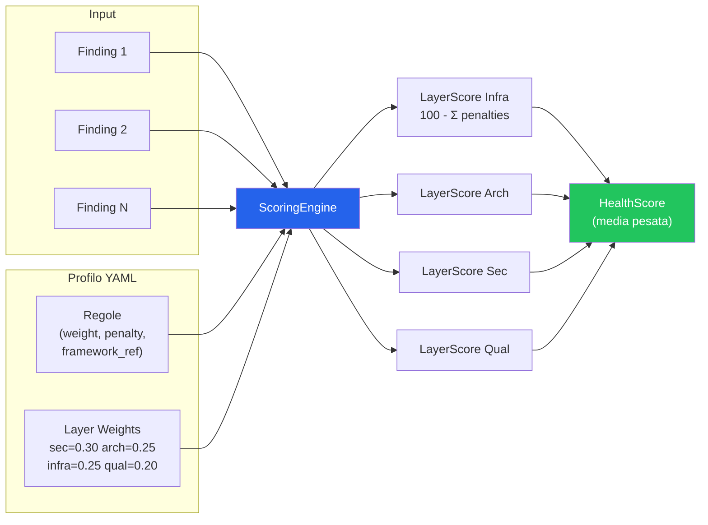

# CTO Audit Agent — Decisioni Architetturali
# v8.0 — Defensible Scoring + Full Benchmark Validation

> **Stato implementazione (v0.4.0)**: Le sezioni marcate con [IMPLEMENTATO]
> riflettono codice funzionante e testato. Le sezioni marcate con [STUB] hanno
> il file creato ma vuoto. Le sezioni marcate [PIANIFICATO] non hanno ancora codice.
> **Tutti e 4 gli analyzer implementati**: Infra (10 regole), Architecture (7 regole),
> Security (9 check), Quality (10 check). Totale: 36 regole di analisi.
> **Compliance engine implementato** con profili NIS2 e GDPR.
> **HTML reporter implementato**. Scoring difendibile con citation dalla letteratura.
> 2 scoring profiles: default + vc-diligence. 43 regole nel profilo (37 penalizzanti + 6 info).
> **Remediation Pipeline**: KB YAML (37 entry), What-If Simulator, Context Collector,
> Board Report deterministico, LLM Provider (Ollama via httpx), Interpretation Agent con HITL gate.
> **733 test**, graceful degradation senza LLM, backward compatible.
> Validato su **29 repo**: 20 reali (media 78.3/100) + 9 sintetiche (100% precision/recall).

## Decisioni Confermate

### 1. Modalità d'uso

| Scenario | Descrizione | Vincoli |
|----------|-------------|---------|
| **Consulente** | Il fractional CTO lancia il tool sui sistemi del cliente | Zero data exfiltration. Solo il report esce. |
| **Self-service** | Il cliente lancia il tool su se stesso | Nessun vincolo. |

### 2. Repo Scope — Multi-Source Nativo

- **MVP**: singolo repo/path locale
- **Architettura**: nativamente multi-source dal giorno 1

```python
class AuditSource(Protocol):
    def get_file_tree(self) -> FileTree: ...
    def read_file(self, path: str) -> str: ...
    def get_metadata(self) -> SourceMetadata: ...

class LocalRepoSource(AuditSource): ...   # MVP
class GitRemoteSource(AuditSource): ...   # Futuro, solo self-service
class MultiSource(AuditSource): ...       # Futuro, aggrega più sorgenti
```

### 3. Infrastruttura Agnostica

Rileva e valuta qualsiasi tipo di infra: Cloud IaC, Container, CI/CD, Config Management, On-prem, Serverless, o assenza totale (= finding critico).

### 4. Privacy — 4 Categorie + HITL Gate

| Categoria | Dove | Qualità |
|-----------|------|---------|
| 🟢 SAFE | LLM Cloud | ⭐⭐⭐⭐⭐ |
| 🟡 LOCAL LLM | Ollama locale | ⭐⭐⭐ |
| 🔴 SENSITIVE | Solo locale (regex, AST) | ⭐⭐ |
| ⚫ ESCLUSO | Non analizzato | N/A |

Gate HITL obbligatorio prima dell'analisi. Dettagli in 03-hitl-flow.md.

### 5. Linguaggio: Python

Motivazione: ecosistema LLM maturo, Typer+Rich per CLI. Il tool analizza qualsiasi linguaggio del cliente. tree-sitter e' nelle dipendenze per uso futuro (parsing AST multi-linguaggio in Fase 2) ma non ancora utilizzato.

### 6. I 4 Layer (priorità CTO)

```
Priority 1: 🏗️ INFRASTRUTTURA
Priority 2: 🧱 ARCHITETTURA  
Priority 3: 🔒 SICUREZZA
Priority 4: 📝 QUALITÀ CODICE
```

---

## Scoring Engine — Architettura Pluggable [IMPLEMENTATO]

### Il Problema

Uno score "42/100" non vale nulla se non sai come e' calcolato. Per un CTO che presenta al board, ogni numero deve essere difendibile. Per questo lo scoring e' un componente separato, configurabile, e tracciabile.

### Design (implementazione reale)

```python
class ScoringProfile:
    """Profilo di scoring caricato da file YAML."""

    name: str                          # es. "default"
    layer_weights: dict[str, float]    # es. {"security": 0.30, "architecture": 0.25, ...}
    default_rule_weight: float         # peso per regole non nel profilo (default: 0.5)

    def get_rule(self, rule_id: str) -> ScoringRule | None: ...

    @classmethod
    def from_yaml(cls, path: Path) -> ScoringProfile: ...

class ScoringEngine:
    """Calcola gli score applicando un profilo ai finding."""

    def __init__(self, profile: ScoringProfile): ...

    def score_layer(self, layer: Layer, findings: list[Finding]) -> LayerScore:
        """Score = max(0, 100 - sum(|penalty| * weight)). Con catena evidenze."""
        ...

    def calculate(self, all_findings: list[Finding]) -> HealthScore:
        """Raggruppa per layer, calcola LayerScore, aggrega con media pesata."""
        ...
```

> **Formula**: `LayerScore = max(0, 100 - sum(|penalty| * weight))`
> `OverallScore = sum(layer_score * layer_weight)`
>
> Finding senza regola nel profilo: gestiti con peso `default_rule_weight` e
> penalita' basate sulla severita' (critical=-20, high=-10, medium=-5, low=-2, info=0).

### Diagramma Scoring (Mermaid)



### Come Funziona

1. L'orchestrator raccoglie i **finding** dai 4 agent
2. I finding passano allo **Scoring Engine** con un profilo attivo
3. Per ogni finding, il profilo dice: peso, penalità, e opzionalmente riferimento a framework
4. L'output è uno **score con catena di evidenze completa**

### Profili di Scoring (file YAML)

```yaml
# scoring-profiles/default.yml — Profilo operativo attuale
name: default
description: "Profilo CTO default — bilanciato su tutti i layer"

layer_weights:    # Pesi relativi per layer (sommano a 1.0)
  security: 0.30
  architecture: 0.25
  infra: 0.25
  quality: 0.20

default_rule_weight: 0.5    # Peso per regole non presenti nel profilo

rules:
  INFRA-CICD-001:
    severity: high
    weight: 0.9
    penalty: -20
    framework_ref: "NIST PR.DS-6"
    description: "Nessun CI/CD pipeline rilevato"

  INFRA-DOCKER-001:
    severity: medium
    weight: 0.5
    penalty: -8
    description: "Nessun Dockerfile rilevato (solo per progetti deployable)"

  INFRA-DOCKER-INFO:             # Context-aware: per progetti non-deployable
    severity: info               # (librerie, tool CLI) Docker assente e' INFO,
    weight: 0.0                  # non penalizzante
    penalty: 0

  INFRA-DOCKER-003:
    severity: medium
    weight: 0.5
    penalty: -5
    description: "Dockerfile senza multi-stage build"

  ARCH-TEST-001:
    severity: critical
    weight: 1.0
    penalty: -22
    description: "Nessuna directory o file di test rilevati"

  ARCH-SCALE-INFO:               # Normalizzazione per dimensione progetto:
    severity: info               # i file grandi oltre il cap vengono riportati
    weight: 0.0                  # come INFO (visibili ma senza penalita')
    penalty: 0

  ARCH-COUPLING-INFO:            # Idem per fan-out eccessivo
    severity: info
    weight: 0.0
    penalty: 0

  # ... 37 regole totali nel profilo (vedi scoring-profiles/default.yml)
```

> **Normalizzazione per dimensione progetto**: le penalita' per finding ripetitivi
> (file grandi ARCH-SCALE-001, fan-out ARCH-COUPLING-002) sono normalizzate in base
> alla dimensione del progetto. I peggiori offendenti vengono penalizzati (MEDIUM),
> il resto e' riportato come INFO (visibile nel report ma 0 penalita'). Questo evita
> che un progetto con 1000+ file venga penalizzato 70x per avere 70 file grandi (4%).
>
> **Profili disponibili**: `default.yml` (bilanciato) e `vc-diligence.yml` (focalizzato
> su metriche rilevanti per due diligence tecnica in contesto VC/investimento).
> Profili aggiuntivi (nist-csf.yml, owasp-asvs.yml) sono pianificati per fasi successive.
> La struttura YAML supporta gia' `framework_ref` per il mapping a framework normativi.

### Flessibilita' garantita

- **Cambiare framework**: copia un profilo YAML, modifica i `framework_ref`
- **Cambiare pesi**: modifica i `weight` e `layer_weights` nel YAML
- **Aggiungere regole**: aggiungi entry nel YAML
- **Creare profilo custom**: `.cto-audit-scoring.yml` nella root del progetto
- **Nessun codice toccato** per nessuna di queste operazioni

### Tabella Regole Scoring (default.yml) — 37 regole (31 penalizzanti + 6 info)

| Rule ID | Layer | Severity | Weight | Penalty | Descrizione |
|---------|-------|----------|--------|---------|-------------|
| INFRA-CICD-001 | infra | high | 0.9 | -20 | Nessun CI/CD pipeline rilevato |
| INFRA-CICD-INFO | infra | info | 0.0 | 0 | CI/CD rilevato (informativo) |
| INFRA-DOCKER-001 | infra | medium | 0.5 | -8 | Nessun Dockerfile (solo progetti deployable) |
| INFRA-DOCKER-INFO | infra | info | 0.0 | 0 | Docker assente in progetto non-deployable (context-aware) |
| INFRA-DOCKER-002 | infra | low | 0.3 | -3 | .dockerignore non presente |
| INFRA-DOCKER-003 | infra | medium | 0.5 | -5 | Dockerfile senza multi-stage build |
| INFRA-DOCKER-004 | infra | medium | 0.6 | -8 | Dockerfile esegue come root |
| INFRA-DOCKER-005 | infra | low | 0.3 | -3 | Dockerfile senza HEALTHCHECK |
| INFRA-IAC-001 | infra | high | 0.7 | -10 | Nessun IaC rilevato |
| INFRA-DEPS-001 | infra | high | 0.8 | -12 | Nessun lockfile |
| INFRA-CONFIG-001 | infra | high | 0.8 | -15 | File .env con dati sensibili nel repo |
| INFRA-CONFIG-002 | infra | high | 0.8 | -15 | Secrets in file di configurazione |
| INFRA-MON-001 | infra | medium | 0.5 | -8 | Nessun monitoraggio rilevato |
| ARCH-STRUCT-001 | architecture | medium | 0.5 | -8 | Struttura directory flat/caotica |
| ARCH-STRUCT-INFO | architecture | info | 0.0 | 0 | Pattern architetturale rilevato (informativo) |
| ARCH-COUPLING-001 | architecture | high | 0.8 | -15 | Import circolari rilevati |
| ARCH-COUPLING-002 | architecture | medium | 0.5 | -5 | Fan-out eccessivo |
| ARCH-COUPLING-INFO | architecture | info | 0.0 | 0 | Fan-out (normalizzato, solo info) |
| ARCH-SCALE-001 | architecture | medium | 0.4 | -3 | File troppo grandi (>500 LOC) |
| ARCH-SCALE-INFO | architecture | info | 0.0 | 0 | File grandi (normalizzato, solo info) |
| ARCH-TEST-001 | architecture | critical | 1.0 | -22 | Nessun test rilevato |
| ARCH-DB-001 | architecture | medium | 0.5 | -8 | ORM senza gestione migrazioni |
| SEC-DEPS-001 | security | high | 0.8 | -12 | Dipendenze vulnerabili (check statico) |
| SEC-DEPS-CVE-001 | security | high | 0.8 | -15 | CVE note (fonte: Google OSV) |
| SEC-AUTH-001 | security | high | 0.8 | -15 | Nessun framework di autenticazione |
| SEC-HTTPS-001 | security | medium | 0.5 | -5 | URL HTTP non cifrati |
| SEC-CORS-001 | security | medium | 0.5 | -5 | CORS permissivo (* origins) |
| SEC-SQL-001 | security | high | 0.9 | -18 | Possibile SQL Injection |
| SEC-SECRETS-CODE-001 | security | critical | 1.0 | -25 | Secrets hardcodati nel codice e config |
| SEC-HEADERS-001 | security | low | 0.3 | -3 | Nessun middleware per security headers |
| SEC-CRYPTO-001 | security | medium | 0.6 | -8 | Algoritmi crittografici deboli |
| QUAL-DOC-001 | quality | medium | 0.5 | -8 | Nessun README nella root |
| QUAL-DOC-002 | quality | low | 0.3 | -3 | Documentazione inline insufficiente |
| QUAL-LINT-001 | quality | medium | 0.5 | -8 | Nessun linter configurato |
| QUAL-TYPING-001 | quality | low | 0.3 | -3 | Nessun type checking |
| QUAL-COMPLEXITY-001 | quality | medium | 0.5 | -7 | Codice eccessivamente annidato |
| QUAL-DUP-001 | quality | low | 0.3 | -3 | Codice duplicato rilevato |

> **Nota**: Il profilo `default.yml` contiene 37 regole totali (31 penalizzanti + 6 informative).
> Le regole INFO (weight=0, penalty=0) servono per normalizzazione per dimensione progetto e
> context-aware analysis. Il profilo `vc-diligence.yml` usa pesi diversi ottimizzati per
> la valutazione di investibilita' tecnica (Security 0.35 vs 0.30).

### Regole per Analyzer — Dettaglio

#### Infra Analyzer [IMPLEMENTATO] — 9 regole

| Rule ID | Severity | Descrizione | Note |
|---------|----------|-------------|------|
| INFRA-CICD-001 | High | Nessun CI/CD pipeline | Rileva GitHub Actions, GitLab CI, Jenkins, etc. |
| INFRA-DOCKER-001 | Medium | Nessun Dockerfile | Context-aware: solo per progetti deployable |
| INFRA-DOCKER-INFO | Info | Docker assente (non-deployable) | Per librerie, CLI tool, etc. — nessuna penalita' |
| INFRA-DOCKER-002 | Low | .dockerignore mancante | Best practice Docker |
| INFRA-DOCKER-003 | Medium | Dockerfile senza multi-stage | Best practice Docker |
| INFRA-DOCKER-004 | Medium | Dockerfile esegue come root | Rischio privilege escalation |
| INFRA-DOCKER-005 | Low | Dockerfile senza HEALTHCHECK | Best practice orchestration |
| INFRA-IAC-001 | High | Nessun IaC | Terraform, CloudFormation, Pulumi, etc. |
| INFRA-DEPS-001 | High | Nessun lockfile | package-lock.json, Pipfile.lock, etc. (17 tipi) |
| INFRA-CONFIG-001 | High | File .env nel repository | Dati sensibili esposti |
| INFRA-CONFIG-002 | High | Secrets in configurazione | Esclude traduzioni (.po/.pot) |
| INFRA-MON-001 | Medium | Nessun monitoring | Prometheus, Grafana, Sentry, DataDog, etc. |

#### Architecture Analyzer [IMPLEMENTATO] — 7 regole

| Rule ID | Severity | Descrizione | Note |
|---------|----------|-------------|------|
| ARCH-TEST-001 | Critical | Nessun test rilevato | Cerca tests/, test/, spec/, __tests__ |
| ARCH-STRUCT-001 | Medium | Struttura directory flat/caotica | Verifica convenzioni per stack |
| ARCH-COUPLING-001 | High | Import circolari | Python e JS/TS |
| ARCH-COUPLING-002 | Medium | Fan-out eccessivo | Normalizzato per dimensione progetto |
| ARCH-SCALE-001 | Medium | File troppo grandi | Normalizzato, esclude .po/LICENSE/CHANGELOG |
| ARCH-DB-001 | Medium | ORM senza migrazioni | Rileva N+1, raw SQL, no migration |

#### Security Analyzer [IMPLEMENTATO] — 9 regole

| Rule ID | Severity | Descrizione | Note |
|---------|----------|-------------|------|
| SEC-SECRETS-CODE-001 | Critical | Secrets nel codice e config | Pattern matching su sorgenti + .properties/.yml/.ini/.conf |
| SEC-SQL-001 | High | SQL injection | String concatenation in query |
| SEC-DEPS-001 | High | Dipendenze vulnerabili | Check statico versioni note |
| SEC-DEPS-CVE-001 | High | CVE note nelle dipendenze | Google OSV API (richiede rete) |
| SEC-AUTH-001 | High | Nessuna autenticazione | Framework auth non rilevato |
| SEC-HTTPS-001 | Medium | URL HTTP non cifrati | Connessioni non TLS |
| SEC-CORS-001 | Medium | CORS permissivo | Wildcard origins |
| SEC-HEADERS-001 | Low | Security headers mancanti | CSP, X-Frame-Options, etc. |
| SEC-CRYPTO-001 | Medium | Crypto debole | MD5, SHA1, DES, RC4 |

#### Quality Analyzer [IMPLEMENTATO] — 10 regole

| Rule ID | Severity | Descrizione | Note |
|---------|----------|-------------|------|
| QUAL-DOC-001 | Medium | Nessun README | README mancante nella root |
| QUAL-DOC-002 | Low | Documentazione insufficiente | Docstring, commenti, API docs |
| QUAL-LINT-001 | Medium | Nessun linter | ESLint, Ruff, Pylint, Biome, etc. |
| QUAL-TYPING-001 | Low | Nessun type checking | mypy, pyright, TypeScript strict |
| QUAL-COMPLEXITY-001 | Medium | Complessita' elevata | Nesting eccessivo (>4 livelli) |
| QUAL-DUP-001 | Low | Codice duplicato | File con nome identico in directory diverse |
| QUAL-PRECOMMIT-001 | Medium | Nessun pre-commit hook | pre-commit, husky, lefthook |
| QUAL-EDITORCONFIG-001 | Low | Nessun .editorconfig | EditorConfig mancante nella root |
| QUAL-CONTRIBUTING-001 | Low | Nessun CONTRIBUTING.md | Guida contributi mancante |
| QUAL-CHANGELOG-001 | Low | Nessun CHANGELOG | CHANGELOG.md, CHANGES.md, HISTORY.md |

---

## Compliance Engine — Architettura Plugin [IMPLEMENTATO]

> **Stato**: Il Compliance Engine e' implementato e testato con profili NIS2 e GDPR.
> I file `compliance/engine.py`, `compliance/models.py`, `compliance/modes.py`,
> `compliance/profile.py` sono operativi. La directory `compliance-profiles/`
> contiene `nis2.yml` e `gdpr.yml`.

### Il Requisito Critico

La compliance deve poter funzionare in **3 modalità diverse** senza refactoring:
1. **Cross-cutting**: i check si iniettano nei 4 layer esistenti
2. **Layer autonomo**: la compliance è un 5° layer separato
3. **Ibrido**: check distribuiti + sezione dedicata nel report

La scelta tra queste modalità è **configurazione runtime**, non codice.

### Design

```python
class ComplianceProfile(Protocol):
    """Un profilo di compliance (es. NIS2, GDPR, AI Act).
    Ogni profilo definisce i propri check e dove si agganciano."""
    
    @property
    def name(self) -> str: ...           # es. "NIS2"
    @property
    def version(self) -> str: ...        # es. "2022/2555"
    
    def get_checks(self) -> list[ComplianceCheck]: ...
    
class ComplianceCheck:
    """Un singolo controllo di compliance."""
    id: str                              # es. "NIS2-ART21-2E"
    description: str                     # es. "Supply chain security measures"
    article_ref: str                     # es. "Art. 21(2)(e)"
    
    # Dove si aggancia — può essere uno o più layer
    target_layers: list[str]             # es. ["infra", "security"]
    
    # Come verifica — può essere deterministico o LLM
    check_type: Literal["deterministic", "llm", "hybrid"]
    
    # Cosa cerca
    patterns: list[str] | None           # per check deterministici
    prompt_template: str | None          # per check LLM

class ComplianceEngine:
    """Esegue i check di compliance. La modalità è configurabile."""
    
    def __init__(self, profiles: list[ComplianceProfile], mode: ComplianceMode): ...
    
    def inject_checks(self, layer: str) -> list[ComplianceCheck]:
        """Modalità cross-cutting: restituisce i check da eseguire dentro un layer."""
        ...
    
    def run_standalone(self, findings: list[Finding]) -> ComplianceReport:
        """Modalità standalone: esegue tutti i check come layer autonomo."""
        ...
    
    def run_hybrid(self, layer: str, findings: list[Finding]) -> ComplianceReport:
        """Modalità ibrida: inject + standalone."""
        ...

class ComplianceMode(Enum):
    CROSS_CUTTING = "cross-cutting"   # Check iniettati nei 4 layer
    STANDALONE = "standalone"          # 5° layer separato
    HYBRID = "hybrid"                  # Entrambi
```

### Profili di Compliance (file YAML)

```yaml
# compliance-profiles/nis2.yml
name: "NIS2 Directive"
version: "2022/2555"
description: "EU Network and Information Security Directive"
effective_date: "2024-10-18"

checks:
  NIS2-ART21-2A:
    description: "Policies on risk analysis and information system security"
    article_ref: "Art. 21(2)(a)"
    target_layers: ["infra", "security"]
    check_type: "hybrid"
    deterministic_signals:
      - file_exists: ["SECURITY.md", "security-policy.*", "risk-assessment.*"]
      - dir_exists: ["docs/security/", "security/"]
    llm_prompt: |
      Analizza se il progetto ha evidenza di:
      - Policy di sicurezza documentata
      - Analisi dei rischi formalizzata
      Rispondi con: SATISFIED / PARTIAL / NOT_SATISFIED + evidenze trovate.
    
  NIS2-ART21-2C:
    description: "Business continuity and crisis management"
    article_ref: "Art. 21(2)(c)"
    target_layers: ["infra"]
    check_type: "hybrid"
    deterministic_signals:
      - file_exists: ["*backup*", "*disaster-recovery*", "*dr-plan*"]
      - config_check: "health_checks_configured"
    llm_prompt: |
      Analizza se il progetto ha evidenza di:
      - Strategia di backup
      - Piano di disaster recovery
      - Health checks e monitoring
      
  NIS2-ART21-2D:
    description: "Supply chain security"
    article_ref: "Art. 21(2)(d)"
    target_layers: ["infra"]
    check_type: "deterministic"
    deterministic_signals:
      - lockfile_exists: true
      - dependencies_pinned: true
      - no_critical_cve: true
      
  NIS2-ART21-2E:
    description: "Security in network and information systems acquisition, development, maintenance"
    article_ref: "Art. 21(2)(e)"
    target_layers: ["infra", "quality"]
    check_type: "deterministic"
    deterministic_signals:
      - cicd_exists: true
      - tests_exist: true
      - sast_configured: true

  NIS2-ART21-2H:
    description: "Policies and procedures regarding the use of cryptography"
    article_ref: "Art. 21(2)(h)"
    target_layers: ["security"]
    check_type: "hybrid"
    deterministic_signals:
      - no_plaintext_secrets: true
      - tls_configured: true
    llm_prompt: |
      Analizza se il progetto gestisce correttamente la crittografia:
      - Encryption at rest e in transit
      - Gestione chiavi
      - Algoritmi aggiornati (no MD5, SHA1, DES)
      
  # ... altri articoli
```

```yaml
# compliance-profiles/gdpr.yml
name: "GDPR"
version: "2016/679"
description: "EU General Data Protection Regulation"

checks:
  GDPR-ART25:
    description: "Data protection by design and by default"
    article_ref: "Art. 25"
    target_layers: ["architecture", "security"]
    check_type: "llm"
    llm_prompt: |
      Analizza l'architettura per evidenze di privacy by design:
      - Separazione dati personali
      - Minimizzazione dati
      - Pseudonimizzazione
      - Default privacy-preserving
      
  GDPR-ART32:
    description: "Security of processing"
    article_ref: "Art. 32"
    target_layers: ["security", "infra"]
    check_type: "hybrid"
    deterministic_signals:
      - encryption_configured: true
      - access_control_exists: true
      - audit_logging_exists: true
    llm_prompt: |
      Verifica le misure di sicurezza per il trattamento dati:
      - Cifratura dati personali
      - Controllo accessi
      - Logging degli accessi ai dati
      - Capacità di ripristino
      
  # ... altri articoli
```

```yaml
# compliance-profiles/ai-act.yml
name: "EU AI Act"
version: "2024/1689"
description: "EU Artificial Intelligence Act"

checks:
  AIACT-ART9:
    description: "Risk management system"
    article_ref: "Art. 9"
    target_layers: ["architecture", "quality"]
    check_type: "llm"
    llm_prompt: |
      Se il progetto contiene componenti AI/ML, verifica:
      - Sistema di gestione rischi documentato
      - Identificazione e analisi rischi noti
      - Misure di mitigazione
      
  AIACT-ART14:
    description: "Human oversight"
    article_ref: "Art. 14"
    target_layers: ["architecture"]
    check_type: "llm"
    llm_prompt: |
      Se il progetto contiene componenti AI/ML, verifica:
      - Meccanismi di supervisione umana
      - Possibilità di override delle decisioni AI
      - Interfacce per monitoraggio umano

  AIACT-ART17:
    description: "Quality management system"
    article_ref: "Art. 17"
    target_layers: ["quality", "infra"]
    check_type: "hybrid"
    deterministic_signals:
      - model_versioning: true
      - tests_ml_exist: true
      - cicd_exists: true
    llm_prompt: |
      Verifica se esiste un sistema di gestione qualità per i componenti AI:
      - Versioning dei modelli
      - Test automatizzati per performance e bias
      - Processo di validazione pre-deploy
      
  # ... altri articoli
```

### Come il Compliance Engine interagisce con i 4 Layer

```
MODALITÀ CROSS-CUTTING (compliance.mode = "cross-cutting"):

  Orchestrator chiede al Compliance Engine:
    "Quali check devo aggiungere al layer Infra?"
    
  Compliance Engine risponde:
    [NIS2-ART21-2C, NIS2-ART21-2D, NIS2-ART21-2E, GDPR-ART32]
    
  Infra Agent esegue i suoi check normali + quelli di compliance
  I finding di compliance finiscono nel report del layer Infra


MODALITÀ STANDALONE (compliance.mode = "standalone"):

  Orchestrator esegue i 4 layer normalmente
  Poi chiede al Compliance Engine:
    "Esegui tutti i tuoi check come layer separato"
    
  Compliance Engine:
    - Raccoglie i finding già prodotti dai 4 layer
    - Esegue i check aggiuntivi non coperti dai layer
    - Produce un report di compliance separato


MODALITÀ HYBRID (compliance.mode = "hybrid"):

  Entrambe le cose:
  - Check iniettati nei layer (per contesto migliore)
  - Sezione dedicata nel report (per vista compliance-centric)
```

### Configurazione runtime

```bash
# Cross-cutting: check integrati nei 4 layer
cto-audit scan . --compliance nis2,gdpr --compliance-mode cross-cutting

# Standalone: compliance come 5° layer
cto-audit scan . --compliance nis2,gdpr --compliance-mode standalone

# Hybrid: entrambi
cto-audit scan . --compliance nis2,gdpr --compliance-mode hybrid

# Nessuna compliance (default)
cto-audit scan .
```

---

## Struttura Progetto (stato reale v0.1.0)

> Legenda: ✅ = implementato e testato, 📄 = stub vuoto, 🔮 = pianificato (file non esiste)

```
cto-audit/
├── pyproject.toml                   ✅
├── README.md                        ✅
├── ARCHITECTURE.md                  ✅ Documento architettura dettagliato
├── 01-cto-audit-concept.md          ✅ Design doc
├── 02-cto-audit-architecture.md     ✅ Design doc
├── 03-cto-audit-hitl-flow.md        ✅ Design doc
│
├── scoring-profiles/
│   ├── default.yml                  ✅ Profilo operativo (31+ regole incl. normalizzazione)
│   └── vc-diligence.yml             ✅ Profilo due diligence VC/investimento
│
├── compliance-profiles/
│   ├── nis2.yml                     ✅ Profilo NIS2 Directive
│   └── gdpr.yml                     ✅ Profilo GDPR
│
├── src/cto_audit/
│   ├── __init__.py
│   ├── cli.py                       ✅ Entry point CLI (Typer + Rich)
│   │
│   ├── core/
│   │   ├── __init__.py
│   │   ├── orchestrator.py          ✅ Coordina scan + HITL + analyzer + scoring
│   │   ├── source.py                ✅ AuditSource protocol
│   │   ├── models.py                ✅ Data models Pydantic (Finding, LayerScore, HealthScore, etc.)
│   │   └── config.py                ✅ Configurazione runtime
│   │
│   ├── sources/
│   │   ├── __init__.py
│   │   ├── local.py                 ✅ LocalRepoSource
│   │   └── git.py                   📄 GitRemoteSource (Fase 3)
│   │
│   ├── collectors/
│   │   ├── __init__.py
│   │   ├── scanner.py               ✅ File system scanner + LOC counting
│   │   ├── stack.py                 ✅ Stack/language detection (13+ linguaggi)
│   │   ├── dependencies.py          📄 Dependency analysis (Fase 2)
│   │   └── privacy.py               ✅ Privacy classifier (EXCLUDED/SENSITIVE/SAFE + entropia)
│   │
│   ├── hitl/
│   │   ├── __init__.py
│   │   ├── reviewer.py              ✅ Review interattivo (terminale Rich)
│   │   └── persistence.py           ✅ Salva/carica .cto-audit-classification.yml
│   │
│   ├── analyzers/
│   │   ├── __init__.py
│   │   ├── base.py                  ✅ Base analyzer interface
│   │   ├── infra.py                 ✅ 10 regole: CICD, containers (context-aware), IaC, deps, secrets, config, monitoring, env-example
│   │   ├── architecture.py          ✅ 7 regole: structure, coupling (circolari+fan-out), large files, tests, database
│   │   ├── security.py              ✅ 9 regole: secrets, SQL injection, XSS, crypto, headers, HTTP, CORS, auth, CVE
│   │   └── quality.py               ✅ 10 regole: documentation, linting, typing, complexity, duplicates, precommit, editorconfig, contributing, changelog
│   │
│   ├── scoring/
│   │   ├── __init__.py
│   │   ├── engine.py                ✅ ScoringEngine: score_layer() + calculate()
│   │   ├── profile.py               ✅ ScoringProfile: carica YAML
│   │   └── models.py                ✅ Re-export da core/models.py
│   │
│   ├── compliance/
│   │   ├── __init__.py
│   │   ├── engine.py                ✅ ComplianceEngine con 3 modalita'
│   │   ├── profile.py               ✅ Caricamento profili YAML
│   │   ├── models.py                ✅ ComplianceCheck, ComplianceResult
│   │   └── modes.py                 ✅ ComplianceMode enum
│   │
│   ├── llm/
│   │   ├── __init__.py
│   │   ├── provider.py              📄 LLM provider interface (Fase 2)
│   │   ├── router.py                📄 Routing file→LLM per classificazione (Fase 2)
│   │   ├── claude.py                📄 Claude integration (Fase 2)
│   │   ├── gemini.py                📄 Gemini integration (Fase 2)
│   │   └── local.py                 📄 Ollama (Fase 3)
│   │
│   └── reporters/
│       ├── __init__.py
│       ├── terminal.py              ✅ Rich terminal output
│       ├── markdown.py              ✅ Markdown report con scoring tracciabile
│       ├── html.py                  ✅ HTML report con template
│       ├── comparison.py            ✅ Confronto tra audit successivi
│       ├── json_export.py           ✅ Export JSON strutturato
│       └── pdf.py                   📄 (Fase 3)
│
├── tests/                           ✅ 733 test totali + 29 repo validate (20 reali + 9 sintetiche)
│   ├── __init__.py
│   ├── fixtures/
│   ├── test_scanner.py
│   ├── test_stack.py
│   ├── test_privacy.py
│   ├── test_hitl.py
│   ├── test_infra.py
│   ├── test_architecture.py
│   ├── test_scoring.py
│   ├── test_orchestrator.py
│   ├── test_realistic_scenarios.py  ✅ 5 scenari realistici E2E
│   ├── test_models.py
│   ├── test_cli.py
│   ├── test_config.py
│   ├── test_source.py
│   └── test_structure.py
│
├── reports/                         Generati da generate_scenario_reports.py
│
└── generate_scenario_reports.py     ✅ Utility per generare report scenari
```

---

## Dipendenze (da pyproject.toml reale)

```toml
[project]
name = "cto-audit"
version = "0.1.0"
description = "Audit your codebase like a CTO — infrastructure, architecture, security, quality, compliance"
requires-python = ">=3.11"

dependencies = [
    "typer>=0.9.0",
    "rich>=13.0",
    "pydantic>=2.0",
    "pydantic-settings>=2.0",
    "tree-sitter>=0.24.0",         # Presente ma non ancora utilizzato (Fase 2)
    "tree-sitter-languages>=1.10", # Presente ma non ancora utilizzato (Fase 2)
    "tomli>=2.0",
    "pyyaml>=6.0",
    "httpx>=0.27.0",
    "gitpython>=3.1",
]

[project.optional-dependencies]
llm-claude = ["anthropic>=0.40.0"]   # Non ancora utilizzato
llm-gemini = ["google-genai>=1.0.0"] # Non ancora utilizzato
llm-local = ["ollama>=0.4.0"]        # Non ancora utilizzato
dev = [
    "pytest>=8.0",
    "pytest-cov>=5.0",
    "ruff>=0.4.0",
]

[project.scripts]
cto-audit = "cto_audit.cli:app"
```

> **Nota**: `tree-sitter`, le dipendenze LLM e `httpx` sono installate ma non
> invocate nel codice attuale. Servono per Fase 2 (AST parsing multi-linguaggio,
> integrazione LLM, check CVE via API).

---

## Validazione su Repository Reali

Oltre ai 733 test automatici con 7 scenari sintetici, il sistema e' stato validato
su **29 repository** (20 reali + 9 sintetiche):

### Benchmark su 20 repo reali (clonate con git)

| Statistica | Valore |
|-----------|--------|
| **Media** | 78.3/100 |
| **Mediana** | 80.5/100 |
| **Min / Max** | 56.3 / 94.0 |
| **Dev. std.** | 8.5 |
| **Linguaggi** | Python, JS/TS, Go, Java, Ruby, Rust, PHP, C#, C |

Top 5:
| Repository | Stack | Score |
|-----------|-------|-------|
| ripgrep | Rust | 94/100 |
| clean-architecture | C#/.NET | 89/100 |
| jekyll | Ruby | 87/100 |
| fiber | Go | 84/100 |
| laravel | PHP | 83/100 |

Report completo: [benchmarks/results/benchmark_report.md](benchmarks/results/benchmark_report.md)

### Benchmark sintetico (9 scenari)

- **Recall**: 100% — tutti i problemi attesi vengono rilevati
- **Precision**: 100% — nessun falso positivo

**Bug corretti durante la validazione**:
- Falsi positivi su file .po/traduzioni, LICENSE, CHANGELOG nel check file grandi
- Rilevamento migrazioni rotto per sottodirectory (es. `cms/migrations/`)
- `.gitignore` con `*.txt` che escludeva `requirements.txt` (fix: whitelist NEVER_IGNORE_FILES)
- Falsi positivi entropia su placeholder e type annotation Python
- Falsi positivi secrets su README e file CI
- Penalita' lineari non normalizzate per dimensione progetto (fix: normalizzazione percentuale)
- Ricerca manifest/lockfile solo per path esatto (fix: ricerca per basename, rileva sottodirectory)
- Falsi positivi INFRA-CONFIG-002 su file .po/.pot traduzione e directory locale/i18n

---

## Documenti Correlati

- **[docs/PROJECT_OVERVIEW.md](docs/PROJECT_OVERVIEW.md)** — Overview strategico (stile YC pitch)
- **01-concept.md** — L'idea, i 4+1 layer, il piano completo
- **03-hitl-flow.md** — Flusso Human-in-the-Loop dettagliato
- **04-due-diligence.md** — Analisi di investibilita
- **[docs/READING_ORDER.md](docs/READING_ORDER.md)** — Guida di lettura top-down
