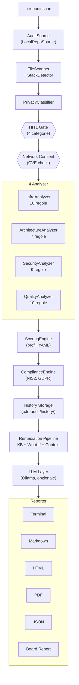
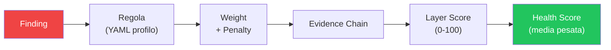
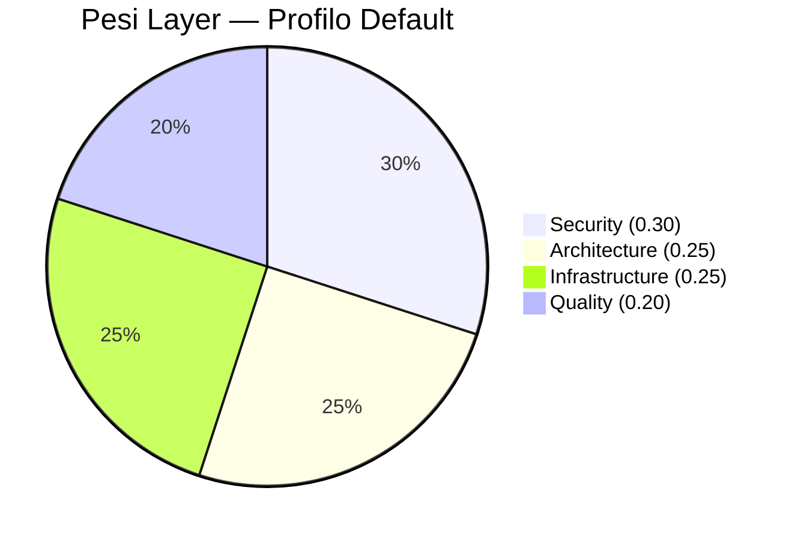

# CTO Audit Agent v0.1.0

Audita codebase come farebbe un CTO esperto: infrastruttura, architettura, sicurezza e qualita del codice. Ogni punteggio e tracciabile fino alla letteratura scientifica e normativa di riferimento.

## Cos'e

CTO Audit Agent e uno strumento da riga di comando scritto in Python che analizza codebase in 13+ linguaggi dal punto di vista di un CTO, non di uno sviluppatore. A differenza di strumenti come SonarQube:

- **Prospettiva executive**: scoring orientato al rischio business, non solo difetti nel codice
- **Scoring tracciabile**: ogni punto e riconducibile a finding, regola, peso e fonte bibliografica
- **Profili di compliance**: NIS2 e GDPR integrati
- **Privacy by design**: gate HITL (Human-In-The-Loop) con 4 categorie di privacy (SAFE, LOCAL_LLM, SENSITIVE, EXCLUDED)
- **Pipeline di remediation**: stima del rischio business e dello sforzo di correzione
- **Funziona offline**: nessuna dipendenza cloud, nessun server da configurare
- **Installazione immediata**: `pip install` e scansione, senza configurare server

## Installazione

**Prerequisiti**: Python 3.11+ ([download](https://www.python.org/downloads/)). Su Windows, durante l'installazione spunta "Add Python to PATH".

Apri un terminale (Prompt dei comandi su Windows, Terminal su macOS/Linux, oppure il terminale integrato di VS Code con `` Ctrl+` ``) e digita:

```bash
pip install cto-audit
```

## Quick Start

Tutti i comandi seguenti vanno digitati nel terminale. Sostituisci `/path/to/codebase` con il percorso reale della cartella del progetto da analizzare (es. `C:\Users\mario\progetti\mio-app` su Windows, oppure `.` per la cartella corrente).

```bash
# Audit base — mostra il risultato nel terminale
cto-audit scan /path/to/codebase

# Report dettagliato in Markdown
cto-audit scan /path/to/codebase --detailed -o report.md

# Modalita offline (senza LLM)
cto-audit scan /path/to/codebase --offline
```

## Funzionalita

### 4 Analyzer implementati

| Analyzer | Regole | Cosa analizza |
|---|---|---|
| **InfraAnalyzer** | 10 | CI/CD, Docker, IaC, monitoraggio, ambienti, .env.example |
| **ArchitectureAnalyzer** | 7 | Struttura del progetto, separazione dei layer, dipendenze |
| **SecurityAnalyzer** | 9 | Segreti hardcoded, dipendenze vulnerabili, CVE check, autenticazione |
| **QualityAnalyzer** | 10 | Test, linting, documentazione, complessita, pre-commit, editorconfig, contributing, changelog |

### Scoring basato sulla letteratura

I pesi di ogni layer sono difendibili con citazioni:

| Layer | Peso | Fonti |
|---|---|---|
| Security | 0.30 | IBM/Ponemon 2025, OWASP, NIS2, GDPR |
| Architecture | 0.25 | Boehm 1981 |
| Infrastructure | 0.25 | DORA 2024 |
| Quality | 0.20 | Boehm 1981 |

Sono disponibili 2 profili di scoring: **default** e **vc-diligence** (per due diligence da parte di venture capital).

### Compliance

Motore di compliance con profili NIS2 e GDPR. Supporta tre modalita operative: cross-cutting, standalone e hybrid.

```bash
cto-audit scan /path/to/codebase --compliance nis2,gdpr
```

### Pipeline di Remediation

- **Knowledge Base YAML**: 37 regole con indicazioni di correzione
- **What-If Simulator**: simula l'impatto delle correzioni sul punteggio
- **Context Collector**: raccoglie contesto per le raccomandazioni
- **Board Report**: report per il management

### Integrazione LLM

Supporta Ollama come provider LLM. Degradazione graziosa: funziona al 100% anche senza LLM disponibile.

### Reporter

- **Terminal** (Rich): output colorato nel terminale
- **Markdown**: report in formato `.md`
- **HTML**: report in formato `.html`
- **JSON**: export strutturato in formato `.json`
- **PDF**: report in formato `.pdf` (richiede `pip install cto-audit[pdf]`)
- **Board Report**: report sintetico per il management
- **Comparison Report**: confronto tra scansioni diverse

### Project Type Detection

Rileva automaticamente il tipo di progetto (web app, frontend, library, CLI tool, data pipeline, prototype) per rendere l'analisi context-aware. 3 livelli in cascata:

1. **Rule-based** (sempre attivo, zero dipendenze): analizza file tree, framework e dipendenze
2. **TF-IDF** (opzionale, stdlib only): analizza il README per migliorare la confidence
3. **Sentence-BERT** (opzionale): `pip install cto-audit[nlp]` per classificazione avanzata

### Confidence Score

Ogni layer score include una **confidence** (0%-100%) che indica quanto il tool e sicuro del punteggio. Tiene conto della coverage delle regole e del tipo di progetto: le regole non applicabili (es. SEC-AUTH-001 su una libreria) vengono escluse dal calcolo.

### Funzionalita aggiuntive

- **Check Docker context-aware**: librerie e tool CLI non vengono penalizzati per l'assenza di Docker
- **Rilevamento lockfile**: 17 tipi di lockfile in 10+ linguaggi
- **Filtro file grandi**: esclude automaticamente directory vendored, dati XML/JSON, migrazioni SQL, file `.resx`, ecc.
- **Flag --detailed**: il report di default ha lunghezza media (finding INFO limitati). Con `--detailed` viene mostrato tutto.

### Storico Audit e Delta

- Ogni audit viene salvato automaticamente in `.cto-audit/history/`
- Al run successivo, mostra il delta: score trend, finding nuovi/risolti/persistenti
- Delta visualizzato in tutti i reporter (Terminal, Markdown, HTML, JSON)
- Supporto completo senza nuove dipendenze

### Consenso Rete Granulare

- Senza `--offline`, il tool mostra un pannello trasparente prima del check CVE
- Spiega cosa viene inviato (nome+versione pacchetti), a chi (Google OSV), cosa NO (codice)
- L'utente acconsente o rifiuta — se rifiuta, lo scan continua senza CVE
- `--offline` = nessuna rete senza domande (backward compatible)
- `--auto-approve` = consenso implicito

## Opzioni CLI

```
cto-audit scan /path/to/codebase [OPZIONI]
```

| Flag | Descrizione |
|---|---|
| `--focus LAYER` | Analizza un singolo layer (security, architecture, infra, quality) |
| `--compliance PROFILES` | Attiva profili di compliance (nis2, gdpr) |
| `--scoring PROFILE` | Profilo di scoring (default, vc-diligence) |
| `--offline` | Modalita offline: nessun accesso alla rete, nessuna domanda |
| `--no-llm` | Disabilita integrazione LLM |
| `--board-report` | Genera report per il management |
| `--detailed` | Report completo con tutti i finding |
| `--auto-approve` | Approva automaticamente il gate HITL |
| `-o, --output FILE` | File di output (.md, .html, .json, .pdf) |

## Esempi d'uso

```bash
# Audit base
cto-audit scan /path/to/codebase

# Con compliance NIS2 e GDPR
cto-audit scan /path/to/codebase --compliance nis2,gdpr

# Board report per il management
cto-audit scan /path/to/codebase --board-report -o board.md

# Report dettagliato
cto-audit scan /path/to/codebase --detailed -o report.md

# Modalita offline
cto-audit scan /path/to/codebase --offline

# Focus su un singolo layer
cto-audit scan /path/to/codebase --focus security

# Profilo VC Due Diligence
cto-audit scan /path/to/codebase --scoring vc-diligence --board-report -o diligence.md

# Export JSON
cto-audit scan /path/to/codebase -o report.json

# Report HTML
cto-audit scan /path/to/codebase -o report.html

# Report PDF (richiede: pip install cto-audit[pdf])
cto-audit scan /path/to/codebase -o report.pdf
```

## Architettura

### Pipeline principale



### Scoring tracciabile



### Pesi layer (literature-backed)



## Test

La suite di test comprende **733 test** distribuiti in 31 file, con 7 scenari end-to-end realistici.

```bash
pytest
```

## Documentazione

- **[Project Overview](docs/PROJECT_OVERVIEW.md)**: overview strategico, differenziatori, metriche chiave
- **[User Guide](docs/USER_GUIDE.md)**: guida completa per interpretare i risultati, personalizzare i profili e scenari d'uso
- **[Tester Guide](docs/TESTER_GUIDE.md)**: come testare e validare il tool
- **[Reading Order](docs/READING_ORDER.md)**: guida di lettura top-down per tutta la documentazione
- **[Validation Methodology](docs/VALIDATION_METHODOLOGY.md)**: metodologia di validazione tramite Claude Code come ground truth

## Validazione

Lo strumento e stato validato su **29 repository** (20 reali + 9 sintetiche):

### Benchmark su 20 repository reali

| Statistica | Valore |
|---|---|
| Media | 78.3/100 |
| Mediana | 80.5/100 |
| Min / Max | 56.3 / 94.0 |
| Linguaggi coperti | Python, JS/TS, Go, Java, Ruby, Rust, PHP, C#, C |

Top 5 per punteggio:

| Repository | Stack | Punteggio |
|---|---|---|
| ripgrep | Rust | 94/100 |
| clean-architecture | C#/.NET | 89/100 |
| jekyll | Ruby | 87/100 |
| fiber | Go | 84/100 |
| laravel | PHP | 83/100 |

Report completo: [benchmarks/results/benchmark_report.md](benchmarks/results/benchmark_report.md)

### Benchmark sintetico (9 scenari)

- **Recall**: 100% — tutti i problemi attesi vengono rilevati
- **Precision**: 100% — nessun falso positivo
