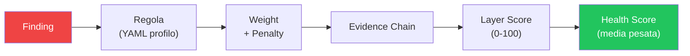
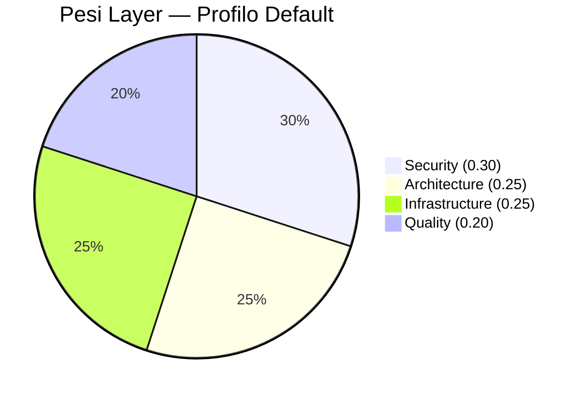

# CTO Audit Agent v0.3.0

Audita codebase come farebbe un CTO esperto: infrastruttura, architettura, sicurezza e qualita del codice. Ogni punteggio e tracciabile fino alla letteratura scientifica e normativa di riferimento.

## Cos'e

CTO Audit Agent e uno strumento professionale scritto in Python che analizza codebase in 13+ linguaggi dal punto di vista di un CTO, non di uno sviluppatore. A differenza di strumenti come SonarQube:

- **Prospettiva executive**: scoring orientato al rischio business, non solo difetti nel codice
- **Scoring tracciabile**: ogni punto e riconducibile a finding, regola, peso e fonte bibliografica
- **Profili di compliance**: NIS2 e GDPR integrati
- **Privacy by design**: gate HITL (Human-In-The-Loop) con 4 categorie di privacy (SAFE, LOCAL_LLM, SENSITIVE, EXCLUDED)
- **Pipeline di remediation**: stima del rischio business e dello sforzo di correzione
- **Due diligence**: profilo a 6 layer (aggiunge Provenienza & IP e Team & Continuita) e report dedicato a chi valuta il codice di un terzo
- **Dashboard interattiva**: UI dark "intelligence style" con Dash + Plotly per navigare i risultati
- **Multi-source**: audit di repo locali, GitHub, GitLab, Azure DevOps, Bitbucket, archivi ZIP/tar.gz
- **Multi-repo**: aggregazione score su N repository con media pesata per LOC
- **Agent mode**: output JSON headless per container e CI/CD
- **Eseguibile standalone**: .exe/.app — doppio click, si apre la dashboard, zero Python
- **Funziona offline**: nessuna dipendenza cloud, nessun server da configurare
- **Installazione immediata**: `pip install` e scansione, senza configurare server

## Installazione

**Prerequisiti**: Python 3.11+ ([download](https://www.python.org/downloads/)). Su Windows, durante l'installazione spunta "Add Python to PATH".

Apri un terminale (Prompt dei comandi su Windows, Terminal su macOS/Linux, oppure il terminale integrato di VS Code con `` Ctrl+` ``) e digita:

```bash
git clone https://github.com/PhysicsInforMe/cto-audit-agent.git
cd cto-audit-agent
pip install -e .
```

Extras opzionali:

```bash
pip install -e ".[nlp]"          # Project type detection avanzata (Sentence-BERT)
pip install -e ".[pdf]"          # Export report in PDF
pip install -e ".[llm-local]"    # Integrazione Ollama
pip install -e ".[ui]"           # Dashboard interattiva (Dash + Plotly)
pip install -e ".[build]"        # Build eseguibile standalone (PyInstaller)
```

## Quick Start

Tutti i comandi seguenti vanno digitati nel terminale. Sostituisci `/path/to/codebase` con il percorso reale della cartella del progetto da analizzare (es. `C:\Users\mario\progetti\mio-app` su Windows, oppure `.` per la cartella corrente).

```bash
# Audit base — mostra il risultato nel terminale
cto-audit scan /path/to/codebase

# Report dettagliato in Markdown
cto-audit scan /path/to/codebase --detailed -o report.md

# Modalita offline (senza LLM)
cto-audit scan /path/to/codebase --offline

# Scan di un repo GitHub remoto
cto-audit scan https://github.com/owner/repo --token ghp_xxxxx

# Dashboard interattiva (richiede: pip install cto-audit[ui])
cto-audit ui

# Agent mode — output JSON per CI/CD o container
cto-audit agent /path/to/codebase -o report.json --offline

# Multi-repo — audit aggregato da config YAML
cto-audit project project.yml -o aggregated.json
```

## Funzionalita

### 4 Analyzer implementati

| Analyzer | Regole | Cosa analizza |
|---|---|---|
| **InfraAnalyzer** | 10 | CI/CD, Docker, IaC, monitoraggio, ambienti, .env.example |
| **ArchitectureAnalyzer** | 7 | Struttura del progetto, separazione dei layer, dipendenze |
| **SecurityAnalyzer** | 9 | Segreti hardcoded, dipendenze vulnerabili, CVE check, autenticazione |
| **QualityAnalyzer** | 10 | Test, linting, documentazione, complessita, pre-commit, editorconfig, contributing, changelog |

Due analyzer aggiuntivi, **ProvenanceAnalyzer** (9 regole) e **TeamAnalyzer** (7 regole), si attivano con il profilo `due-diligence` o con `--focus provenance|team`: vedi [Modalita Due Diligence](#modalita-due-diligence-6-layer).

### Scoring basato sulla letteratura

I pesi di ogni layer sono difendibili con citazioni:

| Layer | Peso | Fonti |
|---|---|---|
| Security | 0.30 | IBM/Ponemon 2025, OWASP, NIS2, GDPR |
| Architecture | 0.25 | Boehm 1981 |
| Infrastructure | 0.25 | DORA 2024 |
| Quality | 0.20 | Boehm 1981 |

Sono disponibili 3 profili di scoring: **default**, **vc-diligence** (4 layer, pesi orientati al rischio security) e **due-diligence** (6 layer, vedi sotto).

### Compliance

Motore di compliance con profili NIS2 e GDPR. Supporta tre modalita operative: cross-cutting, standalone e hybrid.

```bash
cto-audit scan /path/to/codebase --compliance nis2,gdpr
```

### Pipeline di Remediation

- **Knowledge Base YAML**: 37 regole con indicazioni di correzione
- **What-If Simulator**: simula l'impatto delle correzioni sul punteggio
- **Context Collector**: raccoglie contesto per le raccomandazioni
- **Board Report**: report per il management

### Integrazione LLM

L'LLM non partecipa all'analisi ne allo scoring: tutti i finding, i punteggi, la compliance e le stime di effort sono deterministici. L'LLM (Ollama locale) genera solo la narrativa del board report e del report di due diligence (executive summary, rischi, delta), e **nessun testo generato entra in un report senza approvazione esplicita di un revisore umano**: il tool mostra l'output e chiede conferma. Con `--auto-approve` (nessun revisore, es. CI) o con `--no-llm` la narrativa viene dal template deterministico, e il report dichiara l'origine del testo. Degradazione graziosa: funziona al 100% anche senza LLM disponibile.

### Reporter

- **Terminal** (Rich): output colorato nel terminale
- **Markdown**: report in formato `.md`
- **HTML**: report in formato `.html`
- **JSON**: export strutturato in formato `.json`
- **PDF**: report in formato `.pdf` (richiede `pip install cto-audit[pdf]`)
- **Board Report**: report sintetico per il management
- **Comparison Report**: confronto tra scansioni diverse

### Project Type Detection

Rileva automaticamente il tipo di progetto (web app, frontend, library, CLI tool, data pipeline, prototype) per rendere l'analisi context-aware. 3 livelli in cascata:

1. **Rule-based** (sempre attivo, zero dipendenze): analizza file tree, framework e dipendenze
2. **TF-IDF** (opzionale, stdlib only): analizza il README per migliorare la confidence
3. **Sentence-BERT** (opzionale): `pip install cto-audit[nlp]` per classificazione avanzata

### Confidence Score

Ogni layer score include una **confidence** (0%-100%) che indica quanto il tool e sicuro del punteggio. Tiene conto della coverage delle regole e del tipo di progetto: le regole non applicabili (es. SEC-AUTH-001 su una libreria) vengono escluse dal calcolo.

### Modalita Due Diligence (6 layer)

Per chi valuta il codice di un terzo per conto di un investitore, un acquirente o un partner. Ai 4 layer storici aggiunge due layer che rispondono alle domande di una technical due diligence: "il codice e davvero loro?" e "c'e un team dietro, e il codice e vivo?".

```bash
# Report di due diligence (profilo a 6 layer + stime di effort)
cto-audit scan /path/to/codebase --due-diligence --output due-diligence.md

# Stesso profilo, output a terminale
cto-audit scan /path/to/codebase --scoring due-diligence

# Solo un layer di due diligence
cto-audit scan /path/to/codebase --focus provenance
cto-audit scan /path/to/codebase --focus team
```

| Layer | Regole | Cosa verifica |
|---|---|---|
| **Provenienza & IP** (`provenance`) | 9 + 3 info | Licenza del repository stesso, dichiarazione di licenza/copyright, licenze delle dipendenze (copyleft forte GPL/AGPL/SSPL, copyleft debole, commerciali o non standard), codice di terze parti incorporato, header di copyright di piu titolari (distinguendo progetti open source), dichiarazioni del README non riscontrate nel codice, certificazioni dichiarate, SBOM |
| **Team & Continuita** (`team`) | 7 + 2 info | Bus factor (autore unico o >=80% dei commit), repository inattivo (90/180 giorni), storico compresso (>=60% delle righe in 3 commit), storico minimo, assenza di tag di release, messaggi di commit generici, quota di commit co-firmati da assistenti AI |

Il layer Team legge lo storico git solo in forma aggregata: nel risultato e nel report non compaiono nomi ne email degli autori. Se la sorgente e un archivio ZIP o un clone shallow, il layer lo segnala e valuta solo l'attivita recente. Quando il layer Team e attivo le sorgenti remote vengono clonate con lo storico completo.

Il check licenze delle dipendenze funziona in due modi:

- **offline**: knowledge base curata di pacchetti copyleft e commerciali, verificata sui registri PyPI e npm (vedi `collectors/license_checker.py`);
- **con consenso rete**: interroga PyPI e npm per ogni dipendenza (viene inviato solo il nome del pacchetto). Il consenso e lo stesso pannello HITL del check CVE.

Il profilo `due-diligence` pesa i layer per conseguenza sul deal, non per frequenza:

| Layer | Peso | Motivo |
|---|---|---|
| Security | 0.25 | Un breach o una CVE nota pre-closing resta il rischio piu costoso |
| Provenance | 0.20 | Una dipendenza AGPL o codice di terzi senza cessione blocca la cessione dell'asset |
| Team | 0.15 | Bus factor 1 e repository fermi sono rischi che l'infrastruttura non compensa (Avelino et al., ICPC 2016) |
| Architecture | 0.15 | Tech debt come costo nascosto post-investimento |
| Quality | 0.15 | Velocita di iterazione del team che si acquisisce |
| Infra | 0.10 | Recuperabile in settimane dopo l'investimento (DORA 2024) |

Il report di due diligence (`--due-diligence --output file.md`) e pensato per il lato acquirente e contiene: perimetro e limiti del metodo (cosa non si puo verificare dal codice), sintesi con **deal flag**, inventario dell'asset (stack, dimensioni, storico git, inventario licenze), red e yellow flag con il rischio per l'acquirente, dichiarazioni del README a confronto con le evidenze, costo stimato di remediation in ore (dalla knowledge base), **domande per il management** generate dai finding, compliance e evidence chain.

I profili `default` e `vc-diligence` restano a 4 layer e producono gli stessi risultati di prima.

### Source Connectors

Il tool analizza codice da sorgenti diverse, non solo directory locali. Il tipo di sorgente viene rilevato automaticamente dall'input e si puo forzare con `--source-type`.

| Sorgente | Esempio | Auto-detect |
|---|---|---|
| **Locale** | `cto-audit scan /path/to/repo` | Default |
| **GitHub** | `cto-audit scan https://github.com/owner/repo` | `github.com` nell'URL |
| **GitLab** | `cto-audit scan https://gitlab.com/owner/repo` | `gitlab.com` nell'URL |
| **Azure DevOps** | `cto-audit scan https://dev.azure.com/org/project/_git/repo` | `dev.azure.com` nell'URL |
| **Bitbucket** | `cto-audit scan https://bitbucket.org/owner/repo` | `bitbucket.org` nell'URL |
| **Archivio** | `cto-audit scan /path/to/code.zip` | Estensione `.zip`/`.tar.gz` |

Per i repository privati usa `--token` o la variabile d'ambiente `CTO_AUDIT_TOKEN`; il token serve solo per il clone e non viene mai loggato o persistito. `--branch` (o `--tag`) seleziona branch o tag da clonare. Le sorgenti remote fanno un clone shallow (`--depth 1`) in una directory temporanea, che viene rimossa al termine. Requisito: `git` installato e nel PATH.

### Multi-Source (Progetto Multi-Repo)

Per scenari di consulenza con N repository (es. 15 microservizi), un file YAML definisce le sorgenti e il tool le analizza aggregando lo score con una **media pesata per LOC**: un repository con 50.000 LOC pesa 10 volte uno con 5.000.

```yaml
# project.yml
name: "Acme Platform"
sources:
  - name: "backend-api"
    source_type: "github"
    path_or_url: "https://github.com/acme/api"
    token_env: "GITHUB_TOKEN"     # legge il token da questa env var
    branch: "main"
  - name: "frontend"
    source_type: "local"
    path_or_url: "/path/to/frontend"
  - name: "shared-libs"
    source_type: "zip"
    path_or_url: "/path/to/libs.zip"
```

```bash
cto-audit project project.yml -o aggregated.json
```

Il JSON contiene `aggregated_score`, `source_results` per ogni sorgente, `aggregated_layer_scores`, `total_loc` e `failed_sources` (se una sorgente fallisce, le altre continuano).

### Dashboard Interattiva

UI dark "intelligence style" (Dash + Plotly + dash-bootstrap-components) con 8 sezioni: Overview (gauge health score, card layer, stack, maturity), Layers (tab per layer con finding ed evidence chain), Findings (tabella filtrabile), Remediation (azioni prioritarie, what-if), Compliance (ring chart NIS2/GDPR), History (trend score e delta), Source Picker (avvia un audit dalla UI) e Project View (multi-repo).

```bash
pip install cto-audit[ui]
cto-audit ui                # apre il browser automaticamente
cto-audit ui --port 9000    # porta personalizzata
cto-audit ui --no-browser   # utile in container
```

### Agent Mode e Container

Il comando `agent` produce solo JSON: auto-approve implicito, log su stderr, exit code 0 su successo e 1 su errore. Pensato per CI/CD e container.

```bash
# Agent mode — JSON su stdout o file
cto-audit agent /path/to/repo -o report.json --offline
cto-audit agent /path/to/repo --offline | jq '.health_score.overall_score'

# Container Docker
docker build -t cto-audit .
docker run -v /code:/audit:ro -v /out:/output cto-audit agent /audit -o /output/report.json
docker run -p 8050:8050 cto-audit ui --port 8050 --no-browser
```

Il codice e montato read-only e solo il report JSON esce dal container. `docker-compose.yml` definisce i due servizi `agent` e `dashboard`.

### Eseguibile Standalone

Per l'utente non tecnico: scarica l'eseguibile, doppio click, si apre la dashboard nel browser. Zero Python, zero pip, zero terminale. L'eseguibile include dashboard, profili YAML e asset; `git` va installato a parte per le sorgenti remote.

```bash
pip install cto-audit[build]
python scripts/build_exe.py
# → dist/cto-audit.exe (Windows) o dist/cto-audit (macOS/Linux)
```

### Funzionalita aggiuntive

- **Check Docker context-aware**: librerie e tool CLI non vengono penalizzati per l'assenza di Docker
- **Rilevamento lockfile**: 17 tipi di lockfile in 10+ linguaggi
- **Filtro file grandi**: esclude automaticamente directory vendored, dati XML/JSON, migrazioni SQL, file `.resx`, ecc.
- **Flag --detailed**: il report di default ha lunghezza media (finding INFO limitati). Con `--detailed` viene mostrato tutto.

### Storico Audit e Delta

- Ogni audit viene salvato automaticamente in `.cto-audit/history/`
- Al run successivo, mostra il delta: score trend, finding nuovi/risolti/persistenti
- Delta visualizzato in tutti i reporter (Terminal, Markdown, HTML, JSON)
- Supporto completo senza nuove dipendenze

### Consenso Rete Granulare

- Senza `--offline`, il tool mostra un pannello trasparente prima del check CVE
- Spiega cosa viene inviato (nome+versione pacchetti), a chi (Google OSV), cosa NO (codice)
- L'utente acconsente o rifiuta — se rifiuta, lo scan continua senza CVE
- `--offline` = nessuna rete senza domande (backward compatible)
- `--auto-approve` = consenso implicito

## Comandi e Opzioni CLI

### `cto-audit scan` — Audit singolo

```
cto-audit scan <path | URL | archivio> [OPZIONI]
```

| Flag | Descrizione |
|---|---|
| `--source-type TYPE` | Forza il tipo di sorgente: auto, local, github, gitlab, azure-devops, bitbucket, zip |
| `--token TOKEN` | Token per repository private (o env var `CTO_AUDIT_TOKEN`) |
| `--branch REF`, `--tag REF` | Branch o tag da clonare per sorgenti remote |
| `--focus LAYER` | Analizza un singolo layer (security, architecture, infra, quality, provenance, team) |
| `--compliance PROFILES` | Attiva profili di compliance (nis2, gdpr) |
| `--compliance-mode MODE` | Modalita compliance: cross-cutting, standalone, hybrid |
| `--scoring PROFILE` | Profilo di scoring (default, vc-diligence, due-diligence) |
| `--due-diligence`, `--dd` | Profilo `due-diligence` (6 layer), remediation pipeline, report di due diligence se `--output` e un `.md` |
| `--offline` | Modalita offline: nessun accesso alla rete, nessuna domanda |
| `--reuse-classification` | Riusa la classificazione privacy di un run precedente |
| `--no-llm` | Disabilita integrazione LLM |
| `--board-report` | Genera report per il management |
| `--detailed` | Report completo con tutti i finding |
| `--auto-approve` | Approva automaticamente il gate HITL |
| `-o, --output FILE` | File di output (.md, .html, .json, .pdf) |

### `cto-audit project` — Audit multi-repo

```
cto-audit project config.yml [--scoring PROFILE] [--offline] [--auto-approve] [-o output.json]
```

### `cto-audit agent` — Headless JSON

```
cto-audit agent <path | URL> [-o output.json] [--scoring PROFILE] [--offline] [--source-type TYPE] [--token TOKEN] [--branch REF]
```

### `cto-audit ui` — Dashboard

```
cto-audit ui [--port 8050] [--no-browser] [--debug]
```

## Esempi d'uso

```bash
# Audit base
cto-audit scan /path/to/codebase

# Con compliance NIS2 e GDPR
cto-audit scan /path/to/codebase --compliance nis2,gdpr

# Board report per il management
cto-audit scan /path/to/codebase --board-report -o board.md

# Report dettagliato
cto-audit scan /path/to/codebase --detailed -o report.md

# Modalita offline
cto-audit scan /path/to/codebase --offline

# Focus su un singolo layer
cto-audit scan /path/to/codebase --focus security

# Profilo VC Due Diligence (4 layer)
cto-audit scan /path/to/codebase --scoring vc-diligence --board-report -o diligence.md

# Due diligence per conto di un investitore (6 layer, report dedicato)
cto-audit scan /path/to/codebase --due-diligence -o due-diligence.md

# Export JSON
cto-audit scan /path/to/codebase -o report.json

# Report HTML
cto-audit scan /path/to/codebase -o report.html

# Report PDF (richiede: pip install cto-audit[pdf])
cto-audit scan /path/to/codebase -o report.pdf

# Scan repo GitHub
cto-audit scan https://github.com/owner/repo

# Scan repo GitLab privato
cto-audit scan https://gitlab.com/owner/repo --token glpat_xxxxx

# Scan repo Azure DevOps
cto-audit scan https://dev.azure.com/org/project/_git/repo --token xxxxx

# Scan da archivio ZIP
cto-audit scan /path/to/code.zip

# Scan con branch specifico
cto-audit scan https://github.com/owner/repo --branch develop

# Multi-repo
cto-audit project project.yml --offline -o audit-acme.json

# Agent mode (CI/CD, container)
cto-audit agent /path/to/codebase -o report.json --offline

# Dashboard interattiva
cto-audit ui --port 8050

# Container Docker
docker run -v /cliente/codice:/audit:ro -v ./out:/output cto-audit agent /audit -o /output/report.json
```

## Architettura

### Pipeline principale

```mermaid
flowchart TD
    CLI["cto-audit scan | project | agent | ui"] --> Source["AuditSource\n(Local, GitHub, GitLab, Azure, Bitbucket, Archive)"]
    Source --> Scan["FileScanner\n+ StackDetector"]
    Scan --> Privacy["PrivacyClassifier"]
    Privacy --> HITL{{"HITL Gate\n(4 categorie)"}}
    HITL --> Consent{{"Network Consent\n(CVE check)"}}
    Consent --> Analyzers

    subgraph Analyzers["4 Analyzer + 2 Due Diligence"]
        direction LR
        Infra["InfraAnalyzer\n10 regole"]
        Arch["ArchitectureAnalyzer\n7 regole"]
        Sec["SecurityAnalyzer\n9 regole"]
        Qual["QualityAnalyzer\n10 regole"]
        Prov["ProvenanceAnalyzer\n8 regole"]
        Team["TeamAnalyzer\n7 regole"]
    end

    Analyzers --> Scoring["ScoringEngine\n(profili YAML)"]
    Scoring --> Compliance["ComplianceEngine\n(NIS2, GDPR)"]
    Compliance --> History["History Storage\n(.cto-audit/history/)"]
    History --> Remediation["Remediation Pipeline\nKB + What-If + Context"]
    Remediation --> LLM["LLM Layer\n(Ollama, opzionale)"]
    LLM --> Reporters

    subgraph Reporters["Reporter"]
        direction LR
        Term["Terminal"]
        MD["Markdown"]
        HTML["HTML"]
        PDF["PDF"]
        JSON["JSON"]
        Board["Board Report"]
        Dash["Dashboard"]
    end
```



### Scoring tracciabile



### Pesi layer (literature-backed)



## Development

```bash
git clone https://github.com/PhysicsInforMe/cto-audit-agent.git
cd cto-audit-agent
pip install -e ".[dev,ui]"
pytest
```

La suite di test comprende **1.053 test** distribuiti in 58 file, con 7 scenari end-to-end realistici e 3 scenari board report. I 43 test della dashboard richiedono l'extra `ui`.

## Documentazione

- **[Project Overview](docs/PROJECT_OVERVIEW.md)**: overview strategico, differenziatori, metriche chiave
- **[User Guide](docs/USER_GUIDE.md)**: guida completa per interpretare i risultati, personalizzare i profili e scenari d'uso
- **[Tester Guide](docs/TESTER_GUIDE.md)**: come testare e validare il tool
- **[Validation Methodology](docs/VALIDATION_METHODOLOGY.md)**: metodologia di validazione
- **[Architecture](ARCHITECTURE.md)**: documentazione del codice blocco per blocco
- **[Work plan Due Diligence](docs/WORKPLAN_DUE_DILIGENCE.md)**: fasi successive, criteri di uscita, decisioni prese

## Validazione

Lo strumento e stato validato su **29 repository** (20 reali + 9 sintetiche):

### Benchmark su 20 repository reali

| Statistica | Valore |
|---|---|
| Media | 78.3/100 |
| Mediana | 80.5/100 |
| Min / Max | 56.3 / 94.0 |
| Linguaggi coperti | Python, JS/TS, Go, Java, Ruby, Rust, PHP, C#, C |

Top 5 per punteggio:

| Tipo Progetto | Stack | Punteggio |
|---|---|---|
| CLI Tool | Rust | 94/100 |
| Architecture Template | C#/.NET | 89/100 |
| Static Site Generator | Ruby | 87/100 |
| Web Framework | Go | 84/100 |
| Web Framework | PHP | 83/100 |

Report completo: [benchmarks/results/benchmark_report.md](benchmarks/results/benchmark_report.md)

### Benchmark sintetico (9 scenari)

- **Recall**: 100% — tutti i problemi attesi vengono rilevati
- **Precision**: 100% — nessun falso positivo

### Validazione vs Claude Code

Lo strumento e stato inoltre validato confrontando i risultati con quelli prodotti da **Claude Code** (Anthropic), usato come ground truth indipendente. Il framework di confronto misura score distance, precision, recall e finding agreement tra tool e CC. Dettagli sulla metodologia e istruzioni per replicare: [benchmarks/cc_validation/](benchmarks/cc_validation/).
